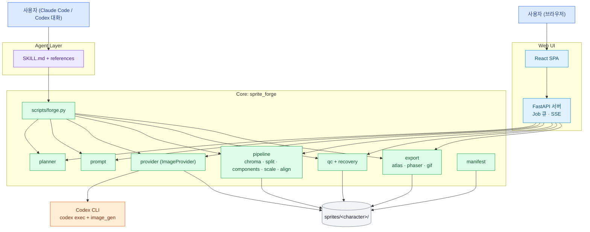
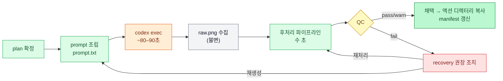

# 01. 시스템 아키텍처

## 1. 개요

시스템은 세 계층으로 나뉜다. 핵심 원칙은 PRD §1의 "AI는 그림을 만들고, 코드는 그림을 정렬·분리·검증·패키징한다"를 구조로 강제하는 것이다. 창작(이미지 생성·외형 분석)은 Codex CLI에 위임하고, 나머지 전부는 deterministic Python 코드가 담당한다.

| 계층 | 구성 | 책임 |
|---|---|---|
| **Agent Layer** | `SKILL.md`, `references/*.md` | 자연어 요청 해석, 액션 번들 추론, 스크립트 호출 순서 결정, QC 실패 시 전략 선택 |
| **Core** | Python 패키지 `sprite_forge` + CLI `scripts/forge.py` | 플랜 생성, 프롬프트 조립, 이미지 provider 호출, 후처리, QC, Atlas/Phaser 내보내기, manifest 기록 |
| **Web UI** | FastAPI 서버 `sprite_forge_web` + React SPA | Core를 브라우저에서 조작. 비동기 Job 큐, 진행 상황 스트리밍, 미리보기, 재처리 |

진입점이 두 개(Skill, Web UI)지만 **Core는 하나**다. 두 경로가 같은 코드로 같은 디렉터리 구조를 만들기 때문에, Skill로 만든 캐릭터를 Web UI에서 이어서 편집할 수 있고 그 반대도 된다.

아래 그림에서 파란색은 사용자 진입점, 초록색은 deterministic 코드, 주황색은 외부 AI 호출, 회색은 파일 시스템이다.



---

## 2. 컴포넌트와 PRD §28 대응

PRD §28의 논리 컴포넌트를 실제 모듈에 1:1로 대응시켰다. "Intent / Planner"의 자연어 해석은 LLM(Agent)의 일이고, 코드는 정규화된 입력만 받는다.

| PRD §28 컴포넌트 | 구현 위치 | 결정성 | 비고 |
|---|---|---|---|
| Intent / Planner | Agent(`SKILL.md`) / Web UI 폼 | 비결정 | 자연어 → `actions`, `view`, `art_style` 같은 정규화된 값 |
| Identity Analyzer | `sprite_forge.identity` → Codex(비전) | 비결정 | `codex exec -i ref.png --output-schema`로 JSON 추출. 사용자가 수정 가능 |
| Animation Planner | `sprite_forge.plan` | **결정** | 프리셋 표 + 사용자 override → `animation-plan.json` |
| Prompt Generator | `sprite_forge.prompt` | **결정** | profile + plan + action → 프롬프트 텍스트. 템플릿 버전 기록 |
| Image Generator | `sprite_forge.providers.codex_cli` | 비결정 | [03](03-codex-image-provider.md) |
| Sprite Processor | `sprite_forge.pipeline.*` | **결정** | [05](05-sprite-pipeline.md) |
| QC Engine | `sprite_forge.qc` | **결정** | [06](06-qc-and-recovery.md) |
| Regenerate 판단 | `sprite_forge.recovery` | **결정** | QC 결과 → 권장 조치 목록. 실행 여부는 Agent/사용자가 결정 |
| Atlas Builder / Engine Exporter | `sprite_forge.export.*` | **결정** | [07](07-export.md) |
| (신규) Manifest | `sprite_forge.manifest` | **결정** | 모든 파일의 sha256, 파라미터, provider 메타 기록 |

---

## 3. 액션 1개 생성 데이터 흐름

액션 하나를 만드는 과정은 Skill 경로와 Web UI 경로가 동일하다. 차이는 누가 다음 단계를 트리거하느냐(Agent vs 사용자 클릭)뿐이다. 생성 단계만 비결정적이고 1회 약 80–90초가 걸리며, 나머지 후처리는 수 초 내에 끝나므로 파라미터를 바꿔 몇 번이든 재처리할 수 있다.

1. Planner가 액션 설정(frames, grid, fps, anchor, scale_strategy)을 확정한다.
2. Prompt Generator가 profile과 액션 설정으로 프롬프트를 조립하고 `prompt.txt`로 저장한다.
3. Codex provider가 `codex exec`를 실행하고, 생성된 PNG를 `attempts/NNN/raw.png`로 복사한다.
4. Pipeline이 배경 제거 → 프레임 분리 → 컴포넌트 필터 → 스케일 → 정렬을 수행한다.
5. QC가 결과를 검사하고 `qc-report.json`을 쓴다. 실패하면 recovery가 권장 조치를 계산한다.
6. 채택(accept)하면 attempt 결과가 액션 디렉터리 최상위로 복사되고 manifest가 갱신된다.



---

## 4. Image Provider 추상화

PRD §30·§31의 provider 독립성을 인터페이스 하나로 보장한다. MVP 구현체는 두 개다.

- `CodexCliProvider`: `codex exec` 기반. 기본 provider.
- `ManualUploadProvider`: 사용자가 다른 도구로 만든 raw sheet를 업로드. Codex를 쓸 수 없는 상황(사용량 한도, 로그아웃)에서도 파이프라인과 QC를 쓸 수 있게 하는 우회로이자, 테스트에서 네트워크 없이 전체 흐름을 돌리는 수단이다.

OpenAI Images API(API 키), Gemini, Flux 등은 같은 인터페이스로 추가하되 MVP 범위가 아니다.

```python
# sprite_forge/providers/base.py
from dataclasses import dataclass, field
from pathlib import Path
from typing import Callable, Protocol

@dataclass(frozen=True)
class GenerationRequest:
    prompt: str                      # Prompt Generator 출력 (verbatim)
    reference_images: list[Path]     # 첨부할 reference (0~2장)
    out_dir: Path                    # attempts/NNN/
    timeout_s: int = 300

@dataclass
class GenerationResult:
    status: str                      # "succeeded" | "failed" | "canceled" | "timeout"
    raw_path: Path | None            # out_dir/raw.png
    error_code: str | None = None    # 03 문서의 에러 코드 표 참고
    error_message: str | None = None
    meta: dict = field(default_factory=dict)  # provider 고유 메타 → generation.json

ProgressFn = Callable[[str, dict], None]   # (stage, payload) → Web UI SSE로 전달

class ImageProvider(Protocol):
    name: str
    def check(self) -> dict: ...     # 설치/인증/기능 상태 (doctor)
    def generate(self, req: GenerationRequest, on_progress: ProgressFn | None = None) -> GenerationResult: ...
    def cancel(self) -> None: ...
```

---

## 5. 기술 스택

| 영역 | 선택 | 이유 |
|---|---|---|
| 언어(Core/Server) | Python 3.11+ | PRD §30. 이미지 처리 생태계 |
| 이미지 처리 | Pillow, NumPy | PRD §30 필수 의존성 |
| 연결 요소 라벨링 | SciPy (`scipy.ndimage`) | PRD의 선택 의존성(OpenCV/scikit-image) 중 가장 가볍고 결정적. OpenCV는 바이너리가 크고 기능 과잉 |
| Perceptual hash | 자체 구현 dHash (NumPy) | 10줄 내외. `imagehash` 의존성 불필요 |
| 스키마 검증 | `jsonschema` | `schemas/*.schema.json` 검증 |
| Web 서버 | FastAPI + uvicorn | Core와 같은 프로세스에서 직접 import. SSE 지원 |
| 프론트엔드 | React + Vite + TypeScript | 캔버스 기반 애니메이션 플레이어, 상태가 많은 스튜디오 화면 |
| 서버 상태 관리(FE) | TanStack Query | 폴링/캐시/무효화 |
| 스타일 | Tailwind CSS | 별도 디자인 시스템 없이 빠른 구성 |
| UI 컴포넌트 | shadcn/ui (Radix + Tailwind) | 소스를 저장소에 복사하는 방식이라 버전 고정·수정이 쉽고, 필요한 컴포넌트만 `shadcn add`로 설치. [09](09-web-ui.md) §9.5 |
| 패키지 관리 | `uv`(Python), `pnpm`(Node) | lockfile로 버전 고정 → 결정성(§31) 보장 |
| 테스트 | pytest, httpx(TestClient), Vitest, Playwright(스모크) | [11](11-testing.md) |
| 이미지 생성 | Codex CLI ≥ 0.159 (검증 버전 0.159.2) | [03](03-codex-image-provider.md) |

버전은 문서에 고정하지 않고 lockfile(`uv.lock`, `pnpm-lock.yaml`)로 고정한다. Pillow·NumPy·SciPy 버전이 바뀌면 리샘플링 결과가 달라질 수 있으므로, 이 세 패키지의 버전 변경은 테스트 기대값 재확인과 함께 별도 커밋으로 한다.

---

## 6. 저장소 구조

`sprite-animation-forge/`는 PRD §29의 배포 단위 그대로다. 이 디렉터리만 `~/.claude/skills/` 또는 `~/.codex/skills/`에 복사해도 동작해야 하므로 Core 패키지를 이 안에 둔다. Web UI는 Skill 배포 단위에 포함하지 않는다.

```text
2d-game-splite/
├── PRD.md
├── README.md
├── docs/                                  # 이 문서들
├── pyproject.toml                         # uv 워크스페이스. sprite_forge, sprite_forge_web 두 패키지
├── uv.lock
│
├── sprite-animation-forge/                # ── Skill 배포 단위 (PRD §29) ──
│   ├── SKILL.md
│   ├── LICENSE
│   ├── references/
│   │   ├── animation-rules.md
│   │   ├── prompt-rules.md
│   │   ├── character-consistency.md
│   │   ├── qc-rules.md
│   │   ├── codex-image.md                 # (신규) Codex 호출 규칙 요약
│   │   ├── phaser-export.md
│   │   └── examples.md
│   ├── scripts/
│   │   ├── forge.py                       # Agent용 단일 CLI 진입점
│   │   └── sprite_forge/                  # Core 패키지
│   │       ├── __init__.py
│   │       ├── plan.py                    # Animation Planner, 프리셋
│   │       ├── identity.py                # Identity 분석 호출/검증
│   │       ├── prompt.py                  # Prompt Generator
│   │       ├── prompt_templates/          # 블록 템플릿 (.txt)
│   │       ├── providers/
│   │       │   ├── base.py
│   │       │   ├── codex_cli.py
│   │       │   └── manual.py
│   │       ├── pipeline/
│   │       │   ├── chroma.py              # PRD remove_background.py
│   │       │   ├── split.py               # PRD split_frames.py
│   │       │   ├── components.py
│   │       │   ├── measure.py
│   │       │   ├── scale.py               # PRD normalize_scale.py
│   │       │   ├── align.py               # PRD align_frames.py
│   │       │   └── process.py             # PRD process_sprite.py (단계 조합)
│   │       ├── qc.py                      # PRD qc_frames.py
│   │       ├── recovery.py
│   │       ├── export/
│   │       │   ├── atlas.py               # PRD build_atlas.py
│   │       │   ├── phaser.py              # PRD export_phaser.py
│   │       │   └── gif.py
│   │       ├── manifest.py
│   │       └── fsutil.py                  # attempt 번호, 원자적 쓰기, 해시
│   ├── schemas/
│   │   ├── animation-plan.schema.json
│   │   ├── character-profile.schema.json
│   │   ├── character-scale-profile.schema.json
│   │   ├── qc-report.schema.json
│   │   └── manifest.schema.json
│   └── tests/
│       ├── fixtures/
│       │   ├── synthetic/                 # 코드로 생성하는 합성 시트
│       │   ├── codex-samples/             # 실제 Codex 생성 raw 시트 (golden, 로컬 전용, .gitignore)
│       │   └── fake_codex/                # 가짜 codex 실행 파일
│       └── test_*.py
│
├── webui/                                 # ── Web UI (Skill 배포 단위 아님) ──
│   ├── server/
│   │   └── sprite_forge_web/
│   │       ├── main.py                    # FastAPI 앱, `sprite-forge-web` 엔트리
│   │       ├── routes/                    # characters, actions, jobs, files, health
│   │       ├── jobs.py                    # 단일 워커 큐
│   │       └── sse.py
│   └── web/
│       ├── package.json
│       ├── vite.config.ts
│       └── src/
│           ├── pages/                     # Dashboard, NewCharacter, Identity, Plan, Studio, Export, Status
│           ├── components/                # AnimationPlayer, GridOverlay, QcPanel, AttemptStrip, ...
│           │   └── ui/                    # shadcn/ui 설치 결과
│           └── api/                       # 타입 정의 + fetch 래퍼
│
└── sprites/                               # 기본 출력 루트 (.gitignore)
```

`scripts/forge.py`는 `sys.path`에 자기 디렉터리를 추가한 뒤 `sprite_forge`를 import한다. 따라서 Skill 디렉터리를 복사한 환경에서도 `pip install` 없이 `python scripts/forge.py ...`로 실행된다(단, Pillow·NumPy·SciPy는 설치되어 있어야 하며 `forge.py doctor`가 이를 검사한다).

---

## 7. 실행 모드

같은 Core를 세 가지 방식으로 실행한다. 모드에 따라 이미지 생성 주체만 달라진다.

| 모드 | 이미지 생성 | 후처리 | 다음 단계 결정 |
|---|---|---|---|
| **A. Skill in Claude Code** | `forge.py generate` → Codex CLI subprocess | `forge.py process` | Claude(Agent) |
| **B. Skill in Codex** | Codex 내장 `image_gen`을 Agent가 직접 호출 후 `forge.py import-raw`로 등록, 또는 모드 A처럼 `forge.py generate` 사용 | `forge.py process` | Codex(Agent) |
| **C. Web UI** | 서버가 `CodexCliProvider` 호출 | 서버가 `pipeline.process` 직접 호출 | 사용자 클릭 |

모드 B에서 Agent가 직접 `image_gen`을 호출하는 경우에도 raw 이미지는 반드시 `import-raw`로 attempt에 등록해야 한다. 그래야 `generation.json`과 manifest에 기록이 남는다(§31 재현성).

```
사용자 요청 → 모드 판별 ─┬─ Claude Code → forge.py generate (Codex subprocess) ─┐
                          ├─ Codex       → image_gen 직접 → forge.py import-raw ─┼→ forge.py process → QC → accept
                          └─ 브라우저     → Web UI 서버 → CodexCliProvider ─────────┘
```

---

## 8. 동시성 모델

Codex 호출은 느리고(1회 약 80–90초) 사용자의 ChatGPT 플랜 사용량을 소모한다. 병렬 실행 시의 rate limit 동작은 검증되지 않았다. 따라서 MVP는 다음 규칙을 따른다.

- Codex 호출은 **프로세스 전체에서 동시에 1개**만 실행한다(Web UI 서버의 단일 워커 큐).
- 후처리(재처리)는 Codex 큐와 별개로 요청 스레드에서 동기 실행한다. 한 액션당 수 초 이내가 목표다.
- 같은 attempt 디렉터리에 대한 쓰기는 attempt 단위 파일 락(`attempts/NNN/.lock`)으로 직렬화한다.

Job 상태 전이는 [10-backend-api.md](10-backend-api.md)에 정의한다.

---

## 9. 보안과 운영 경계

Web UI 서버는 사용자의 Codex 로그인 세션으로 모델을 호출하므로 **로컬 단일 사용자 도구**로 한정한다.

| 항목 | 규칙 |
|---|---|
| 바인딩 | 기본 `127.0.0.1:8765`. `--host 0.0.0.0`은 명시적 opt-in이며, 이때 인증이 없고 Host 헤더 검증이 꺼진다는 경고를 stderr에 출력한다 |
| 인증 | 없음(로컬 전용이므로). 원격 공유가 필요하면 범위 밖 |
| 계정 공유 | 다른 사람이 이 서버를 통해 본인 ChatGPT 계정으로 생성하게 만드는 구성(터널링, 팀 공유)은 지원하지 않는다. 플랜 약관 위반 소지가 있다 [중간] |
| subprocess | `codex`는 인자 리스트로 실행(`shell=False`). 프롬프트는 stdin으로 전달 → 셸 인젝션·따옴표 깨짐 없음 |
| Codex sandbox | `-s workspace-write -C <attempt_dir>`. 작업 루트를 attempt 디렉터리로 둔다. 단, T2 세션 기록상 Codex 기본 정책이 `/tmp` 쓰기도 허용하므로 완전한 격리는 아니다 |
| 파일 서빙 | `/files/...`는 `sprites/` 루트 아래로 정규화된 경로만 허용(`..`, 심볼릭 링크 탈출 차단) |
| 업로드 | PNG/JPEG/WebP만 허용, 최대 20MB, Pillow로 디코드 성공해야 저장 |
| 비밀 정보 | 저장소·manifest에 토큰을 쓰지 않는다. 인증은 전적으로 `$CODEX_HOME/auth.json`(Codex 관리) |

---

## 10. 아키텍처 결정 기록(ADR)

| ID | 결정 | 대안 | 채택 이유 |
|---|---|---|---|
| ADR-001 | MVP 이미지 생성은 Codex CLI `codex exec` subprocess | OpenAI Images API 직접 호출 | API 키 불필요(ChatGPT OAuth). OAuth 토큰으로는 REST API 직접 호출 불가(401)라 CLI 경유가 유일한 방법. API provider는 인터페이스로 추후 추가 |
| ADR-002 | Web 서버는 Python(FastAPI) | Node(Express/Next.js) | Core가 Python이므로 같은 프로세스에서 import. 언어 경계·직렬화 비용 없음 |
| ADR-003 | DB 없이 파일 시스템만 사용 | SQLite | PRD §23 출력 구조 자체가 상태. Skill 모드와 Web UI 모드가 같은 디렉터리를 공유해야 함 |
| ADR-004 | Grid 표기는 `RxC`(행×열) | 열×행 | PRD 프리셋(4→2x2, 6→2x3, 8→2x4)이 "2행 고정, 열 증가" 패턴으로 가장 자연스럽게 읽힘 |
| ADR-005 | 크로마키 기준색은 테두리 샘플 중앙값 | 요청 색(#FF00FF) 고정 | 실측에서 모델이 #FF00FF를 정확히 내지 않음(정확 일치 0%). 03·05 참고 |
| ADR-006 | Agent 진입점은 `scripts/forge.py` 단일 CLI | PRD §29의 단계별 스크립트 8개 | Agent가 기억할 명령이 하나. 단계별 로직은 모듈로 유지해 테스트 단위는 동일 |
| ADR-007 | upstream 코드 재사용 없이 재구현 (PRD §37 Option A) | MIT 코드 재사용 | 라이선스 고지 관리 불필요. 개념 호환(§36)만 유지 |
| ADR-008 | 서버는 `127.0.0.1` 전용 | LAN 공개 옵션 | §9 계정 공유 문제 |
| ADR-009 | Codex 호출 전역 동시 실행 1개 | 병렬 N개 | rate limit 동작 미검증, 사용량 보호. 스파이크 S-4 결과에 따라 재검토 |
| ADR-010 | UI 컴포넌트는 shadcn/ui | 직접 구현, MUI·Ant Design 등 패키지형 라이브러리 | Tailwind 기반이라 스택과 일치. 소스 복사 방식이라 lockfile 외 런타임 의존성이 늘지 않고 필요한 것만 설치 |
| ADR-011 | 탑다운 4방향은 down·up·right 생성 + left는 right 좌우반전, 반전 프레임도 atlas에 포함 | 4방향 전부 Codex 생성, 엔진 `setFlipX`에 위임 | 호출 25% 절감, 좌우 일관성 보장. 게임 코드가 단순해지는 대신 atlas가 커짐(cell 256에서 `topdown-rpg`는 한도 초과). 비대칭 캐릭터는 `mirror={}`로 별도 생성. [02](02-skill-spec.md) §8.1 |
