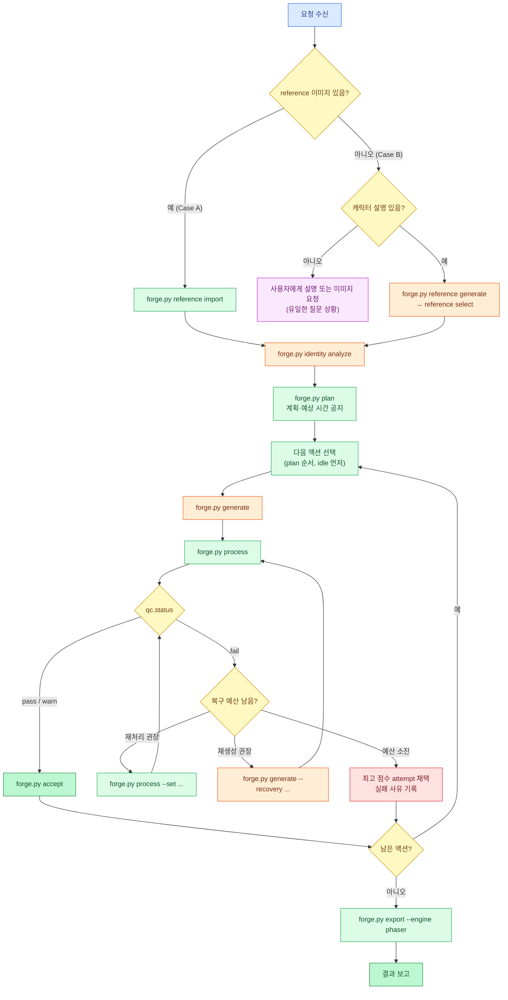

# 02. Skill 명세 (SKILL.md · Animation Planning · CLI 계약)

## 1. Skill의 책임 경계

Skill은 Agent(Claude Code 또는 Codex)가 읽는 지침서다. Agent는 자연어를 해석하고 순서를 결정하며, 실제 작업은 전부 `scripts/forge.py` 하위 명령으로 수행한다. Agent가 직접 이미지를 편집하거나 Python으로 스프라이트를 그리면 안 된다(PRD §1).

| Agent가 하는 일 | 코드가 하는 일 |
|---|---|
| 요청에서 액션 목록·view·스타일·asset type 추론 | 프리셋 적용, grid 계산, plan 파일 생성 |
| 계획과 예상 시간 공지 | 프롬프트 조립, Codex 호출, 결과 수집 |
| QC 결과를 읽고 권장 조치 중 하나를 선택 | 후처리, QC 계산, 권장 조치 목록 산출 |
| 최종 결과 요약·보고 | Atlas·Phaser 파일 생성, manifest 기록 |

---

## 2. Agent 워크플로

Agent는 reference 유무에 따라 두 갈래(PRD §7 Case A/B)로 시작하고, 이후 액션마다 "생성 → 처리 → QC → (복구) → 채택"을 반복한 뒤 마지막에 한 번 내보낸다. 복구는 재처리 최대 2회, 재생성 최대 2회로 제한하고, 한도를 넘으면 가장 나은 attempt를 채택하고 실패 사유를 보고한다.



**idle을 먼저 만드는 이유**: 첫 번째로 채택된 body 액션이 Character Scale Profile(PRD §18)의 기준이 된다. idle은 포즈 변화가 가장 작아 기준으로 적합하다. 사용자가 idle을 요청하지 않았더라도 스케일 기준이 필요하면 idle을 먼저 생성하되, 최종 export에는 사용자가 요청한 액션만 포함한다.

---

## 3. 질문 정책

PRD §39는 "별도 추가 질문 없이" 결과를 만들 것을 요구한다. Agent는 다음 한 가지 경우에만 질문한다.

- reference 이미지도 없고 캐릭터 설명도 없을 때("애니메이션 만들어줘"만 있는 경우)

그 외에는 추론한 값을 쓰고, 가정한 내용을 `manifest.json`의 `assumptions` 배열과 최종 보고에 남긴다. 시작 전에 계획과 예상 소요 시간(액션 수 × 약 90초)을 한 번 출력하되 확인을 기다리지 않는다.

---

## 4. 파라미터 추론 규칙

PRD §26 파라미터마다 기본값과 추론 규칙을 정한다. 사용자가 명시한 값이 항상 우선한다.

| 파라미터 | 기본값 | 추론 규칙 |
|---|---|---|
| `asset_type` | `character` | player/hero/주인공/플레이어 → `player`, enemy/적/몬스터/보스 → `enemy`, npc/상인/주민 → `npc`, 비인간형 생물 → `creature` |
| `view` | `side` | 횡스크롤/side-scroll/platformer → `side`, 탑다운/top-down/필드 RPG → `topdown`, 쿼터뷰/isometric/3/4 → `3/4`, 정면 → `front`, 뒷모습 → `rear` |
| `facing` (신규) | view별 | side → `right`, topdown → `down`, 3/4 → `down-right`, front → `camera`, rear → `away` |
| `frames` | 프리셋(§5) | "N프레임" 명시 시 그 값. 범위 2–16 |
| `grid` | `auto` | §5.2 grid 자동 계산 |
| `anchor` | 액션별(§6) | body 액션 → `feet`(death는 `bottom`), FX/projectile → `center` |
| `scale_strategy` | 액션별(§6) | 긴 무기·큰 망토·넓은 포즈가 설명에 있으면 해당 액션을 `preserve`로 |
| `art_style` | `auto` | reference 있음 → `project_native`, "픽셀"/pixel → `pixel_art`, "16비트"/"레트로"/SNES → `retro_pixel`, 그 외 → `clean_hd` |
| `reference` | 입력에 따라 | 첨부 이미지 → `attached_image`, 경로 → `local_file`, 없음 → Case B로 `generated_image` |
| `engine` | `phaser` | generic 출력은 항상 함께 생성. godot/unity는 MVP 범위 밖(요청 시 generic만 생성하고 알림) |
| `cell` (신규) | `128x128` | "HD"/"고해상도" 언급 시 `256x256` |

---

## 5. Frame Preset

### 5.1 액션별 프리셋

PRD §10 표에 `fall`과 fps를 추가했다. fps는 PRD §9 예시(idle 6, walk 10, run 12, attack 12)를 따르고 나머지는 같은 감각으로 정했다.

| Action | Frames | Grid (RxC) | Loop | FPS |
|---|---:|---|---|---:|
| idle | 4 | 2x2 | Yes | 6 |
| walk | 6 | 2x3 | Yes | 10 |
| run | 6 | 2x3 | Yes | 12 |
| attack | 6 | 2x3 | No | 12 |
| shoot | 4 | 2x2 | No | 12 |
| cast | 6 | 2x3 | No | 10 |
| jump | 4 | 2x2 | No | 10 |
| fall | 2 | 1x2 | Yes | 8 |
| hurt | 4 | 2x2 | No | 10 |
| death | 8 | 2x4 | No | 8 |

### 5.2 Grid 자동 계산

사용자가 frames만 바꾸면 grid는 아래 표로 정한다. 긴 한 줄(1xN, N≥4)은 쓰지 않는다(PRD §10: 위치 드리프트와 crop 문제). frames가 칸 수보다 적으면 남는 칸은 비워 두도록 프롬프트에 명시하고, 파이프라인은 읽기 순서상 앞의 `frames`개 칸만 사용한다.

| frames | grid | 빈 칸 |
|---:|---|---:|
| 2 | 1x2 | 0 |
| 3 | 1x3 | 0 |
| 4 | 2x2 | 0 |
| 5–6 | 2x3 | 0–1 |
| 7–8 | 2x4 | 0–1 |
| 9 | 3x3 | 0 |
| 10–12 | 3x4 | 0–2 |
| 13–16 | 4x4 | 0–3 |

읽기 순서는 항상 **왼쪽→오른쪽, 위→아래**(row-major)다. frames > 16은 MVP에서 오류로 처리한다.

---

## 6. 액션별 처리 기본값

[05-sprite-pipeline.md](05-sprite-pipeline.md)와 [06-qc-and-recovery.md](06-qc-and-recovery.md)가 참조하는 기본값이다. PRD §17의 fit/preserve 권장을 따랐다.

| Action | anchor | scale_strategy | x_anchor | components | QC profile |
|---|---|---|---|---|---|
| idle | feet | fit | mass | largest | locomotion |
| walk | feet | fit | mass | largest | locomotion |
| run | feet | fit | mass | largest | locomotion |
| attack | feet | preserve | feet | largest | action |
| shoot | feet | preserve | feet | largest | action |
| cast | feet | preserve | feet | largest | action |
| jump | feet | fit | mass | largest | airborne |
| fall | feet | fit | mass | largest | airborne |
| hurt | feet | fit | mass | largest | action |
| death | bottom | preserve | feet | largest | terminal |
| fx (종류 무관) | center | fit | bbox | all | fx |

- `x_anchor=mass`: body 마스크의 질량 중심 X를 칸 중앙에 맞춘다. 무기가 짧은 이동 동작에 적합하다.
- `x_anchor=feet`: 마스크 하단 12% 영역의 질량 중심 X를 맞춘다. 공격 시 칼이 앞으로 뻗어도 발 위치가 고정된다.
- `x_anchor=bbox`: bbox 중앙. FX용.

---

## 7. 번들 프리셋

요청에 액션 목록이 없고 용도만 있을 때(PRD §27 "자동 판단") 쓰는 묶음이다.

| 번들 | 트리거 예 | 액션 |
|---|---|---|
| `side-action` | "횡스크롤 액션 게임에서 쓸 수 있게" | idle, walk, run, jump, fall, attack, hurt, death |
| `side-basic` | "기본 애니메이션", "게임용 애니메이션" | idle, walk, run, attack |
| `topdown-rpg` | "탑다운 RPG용" | idle, walk, attack, hurt, death |
| `npc` | "NPC", "상인" | idle, walk |

---

## 8. Animation Plan

`forge.py plan`이 만드는 `animation-plan.json` 예시다. PRD §9 구조에 처리 파라미터를 추가했다. 액션별 값은 §5·§6 기본값에서 시작하고 사용자 override가 덮어쓴다.

```json
{
  "schema_version": 1,
  "character": "hero",
  "asset_type": "player",
  "view": "side",
  "facing": "right",
  "art_style": "project_native",
  "cell": { "w": 128, "h": 128 },
  "margin": { "top": 8, "side": 8, "bottom": 10 },
  "key_color": "#FF00FF",
  "engine": "phaser",
  "actions": {
    "idle":   { "frames": 4, "grid": "2x2", "loop": true,  "fps": 6,  "anchor": "feet", "scale_strategy": "fit",      "x_anchor": "mass", "components": "largest" },
    "walk":   { "frames": 6, "grid": "2x3", "loop": true,  "fps": 10, "anchor": "feet", "scale_strategy": "fit",      "x_anchor": "mass", "components": "largest" },
    "run":    { "frames": 6, "grid": "2x3", "loop": true,  "fps": 12, "anchor": "feet", "scale_strategy": "fit",      "x_anchor": "mass", "components": "largest" },
    "attack": { "frames": 6, "grid": "2x3", "loop": false, "fps": 12, "anchor": "feet", "scale_strategy": "preserve", "x_anchor": "feet", "components": "largest" }
  },
  "order": ["idle", "walk", "run", "attack"],
  "assumptions": [
    "view=side (요청에 '횡스크롤' 포함)",
    "art_style=project_native (reference 이미지 제공)"
  ]
}
```

`key_color`는 profile 팔레트와 충돌하면 plan 생성 시 `#00FF00`으로 바뀐다([05](05-sprite-pipeline.md) §3.4).

---

## 9. `forge.py` CLI 계약

### 9.1 공통 규칙

- 형식: `python scripts/forge.py <command> [args]`
- 출력: **stdout에는 JSON 객체 하나만** 쓴다(Agent가 파싱). 사람용 로그는 stderr.
- 공통 옵션: `--root <dir>`(기본 `./sprites`), `--quiet`
- 종료 코드

| 코드 | 의미 |
|---:|---|
| 0 | 명령 성공. **QC 실패도 0**이다. QC 결과는 JSON의 `qc.status`로 판단한다 |
| 1 | 인자·입력 검증 오류 |
| 2 | 이미지 provider 오류(JSON에 `error_code` 포함, [03](03-codex-image-provider.md) §8) |
| 3 | 선행 조건 미충족(예: reference 없음, plan 없음, 채택된 attempt 없음) |

### 9.2 명령 목록

| 명령 | 입력 | 산출물 | stdout 요지 |
|---|---|---|---|
| `doctor` | — | — | [03](03-codex-image-provider.md) §11 JSON |
| `init <cid>` | `--view --art-style --asset-type` | `sprites/<cid>/manifest.json` | `{character, dir}` |
| `reference import <cid> <file>` | 이미지 파일 | `reference/source.*`, `character.png`, `character-keyed.png` | `{reference, bg_removed}` |
| `reference generate <cid>` | `--description`, `--count 1..4` | `reference/attempts/NNN/` | `{attempts:[...]}` |
| `reference select <cid> <NNN>` | — | `reference/character*.png` | `{reference}` |
| `identity analyze <cid>` | — | `character-profile.json` | `{profile}` |
| `plan <cid>` | `--actions a,b,c` 또는 `--bundle`, `--set <action>.<key>=<value>`, `--cell 128x128` | `animation-plan.json` | `{plan, estimated_seconds}` |
| `prompt <cid> <action>` | `--extra "<text>"`, `--recovery <code>` | (저장 안 함) | `{prompt}` |
| `generate <cid> <action>` | `--extra`, `--recovery <code>`, `--timeout 300` | `<action>/attempts/NNN/{prompt.txt, raw.png, generation.json, codex-*.{jsonl,txt}}` | `{attempt, status, error_code?}` |
| `import-raw <cid> <action> <file>` | 외부 raw sheet | `<action>/attempts/NNN/raw.png` + `generation.json(provider=manual)` | `{attempt}` |
| `process <cid> <action>` | `--attempt NNN`(기본 최신), `--set <key>=<value>` | `clean.png`, `frames/`, `sheet.png`, `process.json`, `qc-report.json` | `{attempt, qc:{status, failed:[...], recommendations:[...]}}` |
| `accept <cid> <action>` | `--attempt NNN` | 액션 디렉터리 최상위 복사, `character-scale-profile.json`(첫 body 액션일 때) | `{accepted}` |
| `export <cid>` | `--engine phaser` | `atlas/`, `animations.json`, `preview/*.gif`, `qc-report.json`, `manifest.json` | `{files:[...], warnings:[...]}` |
| `status <cid>` | — | — | 액션별 상태, 채택 attempt, QC 요약 |

### 9.3 사용 예

```bash
python scripts/forge.py doctor
python scripts/forge.py init hero --view side
python scripts/forge.py reference import hero ./knight.png
python scripts/forge.py identity analyze hero
python scripts/forge.py plan hero --actions idle,walk,run,attack
python scripts/forge.py generate hero idle
python scripts/forge.py process hero idle
python scripts/forge.py accept hero idle
# ... walk, run, attack 반복 ...
python scripts/forge.py export hero --engine phaser
```

QC 실패 후 재처리·재생성 예:

```bash
python scripts/forge.py process hero attack --set scale_strategy=preserve
python scripts/forge.py generate hero attack --recovery edge_touch
```

---

## 10. SKILL.md 초안

`SKILL.md`는 Agent가 읽는 문서이므로 영어로 쓰고, 한국어 트리거 표현을 description에 포함한다. 세부 규칙은 `references/`로 분리해 필요할 때만 읽게 한다(컨텍스트 절약).

```markdown
---
name: sprite-animation-forge
description: >
  Create game-ready 2D character sprite animations (idle, walk, run, attack, jump, hurt, death...)
  from a character image or a text description. Generates each action separately with the Codex
  image_gen tool, removes the chroma background, aligns feet, normalizes scale, runs automated QC,
  and exports PNG frames, sprite sheets, GIF previews and a Phaser atlas + animations.json.
  Triggers: "sprite sheet", "sprite animation", "game character animation", "Phaser atlas",
  "스프라이트", "캐릭터 애니메이션", "게임용 애니메이션", "idle/walk/run 만들어줘".
---

# sprite-animation-forge

Philosophy: the image model draws; deterministic scripts split, align, verify and package.
Never draw or edit sprite pixels yourself (no PIL drawing, no SVG). Use `scripts/forge.py` only.
`scripts/forge.py` is relative to THIS skill's directory. Run it from the user's project directory
so outputs go to `./sprites/` there.

## Workflow
1. `python scripts/forge.py doctor` — stop and tell the user what to fix if `ready` is false.
2. `init` the character. Case A (image given): `reference import`. Case B (text only):
   `reference generate --description "..."` then `reference select`.
   Ask a question ONLY if there is neither an image nor a description.
3. `identity analyze`.
4. Infer actions/view/style (see references/animation-rules.md) and run `plan`.
   Print the plan and the estimated time, then continue without waiting.
5. For each action in plan order (idle first):
   `generate` → `process` → read `qc.status`.
   - pass/warn → `accept`.
   - fail → apply the FIRST item of `qc.recommendations`:
     `reprocess` → `process --set ...` (max 2 times per action)
     `regenerate` → `generate --recovery <code>` then `process` (max 2 times per action)
   - Budget exhausted → `accept --attempt <best>` and record the failure in your report.
6. `export --engine phaser`.
7. Report: output paths, per-action QC status, assumptions, failures.

## Rules
- One action per generation. Never request a mixed-action sheet.
- Never overwrite raw.png. Every generation is a new attempt.
- If running inside Codex and you call image_gen yourself, register the image with `import-raw`.
- Details: references/prompt-rules.md, references/qc-rules.md, references/codex-image.md,
  references/phaser-export.md, references/examples.md.
```

---

## 11. `references/` 구성

| 파일 | 내용 | 원천 문서 |
|---|---|---|
| `animation-rules.md` | 파라미터 추론 규칙, 프리셋, 번들, 액션별 기본값 | 이 문서 §4–§7 |
| `prompt-rules.md` | 프롬프트 블록 구조, 모션 라이브러리, 금지 규칙 | [04](04-prompt-rules.md) |
| `character-consistency.md` | Identity Lock 원칙, 변경 허용 요소(pose, limb, lean, expression, weapon motion, secondary motion) | PRD §8, [04](04-prompt-rules.md) §3 |
| `qc-rules.md` | QC 항목, 복구 권장 조치 해석법, 복구 예산 | [06](06-qc-and-recovery.md) |
| `codex-image.md` | Codex 사전 점검, 에러 코드별 대응, Codex 런타임에서의 `import-raw` 규칙 | [03](03-codex-image-provider.md) |
| `phaser-export.md` | 결과물 사용법(로드·애니메이션 생성 코드) | [07](07-export.md) |
| `examples.md` | PRD §27 사용 예 4종과 각각의 기대 plan | PRD §27 |
