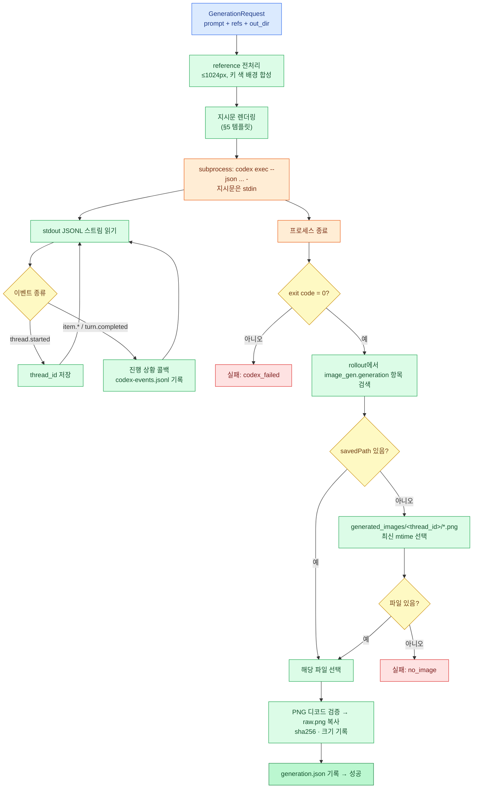

# 03. Codex CLI 이미지 생성 어댑터

> 이 문서는 모든 이미지 생성 경로(Skill 모드 A, Web UI)의 전제다. 아래 "검증 결과"는 2026-09-30에 로컬 환경에서 실제로 `codex exec`를 실행해 얻은 것이다. 추정한 내용에는 신뢰 수준을 표시했다.

## 1. 목적과 결론

Codex CLI의 비대화형 모드 `codex exec`는 ChatGPT OAuth 로그인만으로 내장 `image_gen` 도구를 호출할 수 있다. OAuth 토큰으로 OpenAI REST API를 직접 호출하면 401이 나므로, **API 키 없이 이미지를 만들려면 `codex exec`를 subprocess로 실행하는 방법밖에 없다.** 이 문서는 그 호출 규약, 결과 수집 방법, 에러 처리를 정의한다.

결론:

- 호출: `codex exec --json ... -i <ref> -o <file> -` 를 인자 리스트로 실행하고 지시문은 stdin으로 넘긴다.
- 결과 수집: stdout JSONL의 `thread.started` 이벤트에서 `thread_id`를 얻고, `$CODEX_HOME/generated_images/<thread_id>/*.png`에서 결과 파일을 가져온다. Codex 에이전트에게 파일 복사를 시키지 않는다(LLM의 지시 이행 여부에 의존하지 않기 위해).
- 메타데이터: `$CODEX_HOME/sessions/**/rollout-*-<thread_id>.jsonl`에서 `image_gen.generation` 항목을 읽어 `revisedPrompt`, `savedPath`, `failure`를 기록한다(best-effort).
- 후처리 파이프라인은 **출력 해상도와 배경색을 가정하지 않는다.**

---

## 2. 실측 검증 결과

**검증 환경**: macOS (Darwin 27.0.0), `codex-cli 0.159.2`, ChatGPT 로그인(`codex login status` → `Logged in using ChatGPT`), `codex features list`에서 `image_generation stable true`.

**검증 방법**: 두 번 실제로 생성했다.

- T1: 텍스트만으로 2x2 idle 시트(빨간 후드 기사, #FF00FF 배경) 생성
- T2: T1 결과의 첫 칸을 잘라 `-i`로 첨부하고 2x3 walk 시트 생성

결과 이미지와 로그는 저장소에 보관하지 않는다. 측정값은 아래 표에 기록했고, 같은 검증은 live 계약 테스트(§13)로 언제든 다시 할 수 있다.

| # | 사실 | 신뢰 | 근거 |
|---|---|---|---|
| F1 | `codex exec`에 `--json`, `-i/--image`, `-o/--output-last-message`, `--output-schema`, `-s/--sandbox`, `-C/--cd`, `--skip-git-repo-check`, `--ephemeral`, `--ignore-user-config` 옵션이 있다 | 높음 | `codex exec --help` |
| F2 | 프롬프트 인자를 생략하거나 `-`를 주면 지시문을 stdin에서 읽는다 | 높음 | `--help` 문구. stdin 경로 자체는 계약 테스트로 확인 필요 |
| F3 | 1회 생성 소요 시간은 T1 81초, T2 87초 | 높음 | 실측 |
| F4 | 출력 해상도는 요청과 무관하게 T1·T2 모두 **1254×1254 RGB**였다. 과거 세션에는 1536×1024 결과도 있다 | 높음 | Pillow로 확인 |
| F5 | 내장 도구 호출 형태는 `image_gen__imagegen({referenced_image_paths:[...], prompt:"..."})`였다. size 파라미터는 쓰이지 않았다 | 높음(이 버전) | rollout 로그 |
| F6 | 결과 파일은 `$CODEX_HOME/generated_images/<thread_id>/exec-<uuid>.png`에 저장된다. 디렉터리 이름이 JSONL `thread.started`의 `thread_id`와 정확히 일치한다 | 높음 | T1·T2 모두 확인 |
| F7 | 파일명 패턴은 버전마다 달랐다(`ig_*.png`, `call_*.png`, `exec-*.png`가 공존) → **파일명 패턴에 의존하면 안 된다** | 높음 | `generated_images/` 전수 조사 |
| F8 | stdout JSONL에는 이미지 생성 항목이 나오지 않는다. 나오는 이벤트는 `thread.started`, `turn.started`, `item.started`/`item.completed`(`agent_message`, `command_execution`, `error`), `turn.completed`(usage)뿐이다 | 높음 | T1·T2 |
| F9 | rollout 파일에는 `event_msg` → `item_completed` → `item.type="Extension"`, `kind="image_gen.generation"` 항목이 있고 `status`, `revisedPrompt`, `result`(base64 PNG), `transparentBackground`, `failure`, `savedPath` 필드를 가진다 | 높음(이 버전) | T2 rollout. **내부 포맷이므로 버전 변경 시 깨질 수 있다** |
| F10 | `-i`로 첨부한 이미지는 `referenced_image_paths`로 image_gen에 전달되고, 캐릭터 정체성이 잘 유지되었다(헬멧·후드·망토·칼·팔레트 일치) | 높음(1회 관찰) | T2 결과 육안 확인 |
| F11 | Codex 내부 `imagegen` 스킬이 우리가 준 프롬프트를 자체 형식(`Use case: identity-preserve / Asset type: ... / Avoid: ...`)으로 **재작성**했다. 내용은 보존됐다 | 높음 | T2 `revisedPrompt` |
| F12 | 배경이 정확한 #FF00FF가 아니다. #FF00FF와 정확히 일치하는 픽셀 0%, 배경 평균 (250, 3, 250)/(246, 5, 248), 모서리 픽셀은 #FF00FF와의 거리 최대 약 44 | 높음 | 픽셀 통계 |
| F13 | 테두리 샘플 중앙값을 기준으로 하면 배경 픽셀의 99%가 거리 11 이내, 최대 약 40이다. 거리 20~120 사이 전이 픽셀은 전체의 0.3% 미만이라 경계가 선명하다 | 높음 | 픽셀 통계 |
| F14 | grid 칸 사이에 배경만 있는 세로/가로 띠(gutter)가 이상적 경계 근처에 존재했다. 예: T2(2x3)의 이상적 세로 경계 418/836 → 실제 gutter 405–429, 799–845 | 높음(2회 관찰) | 열/행 전수 검사 |
| F15 | T2 gutter 폭은 24px까지 좁았다. 캐릭터가 칸 경계에 가깝게 그려질 수 있다 | 높음 | 동일 |
| F16 | 사용자 `~/.codex/config.toml`의 알 수 없는 설정이 JSONL에 `item.type="error"`로 2회 출력됐지만 실행은 정상 종료(exit 0)했다 → `error` 항목을 치명적 오류로 취급하면 안 된다 | 높음 | T1·T2 |
| F17 | stdin을 `/dev/null`로 막아도 stderr에 `Reading additional input from stdin...`이 출력된다. 동작에는 영향 없음 | 높음 | T2 |
| F18 | 1회 호출 입력 토큰 T1 약 9.3만(캐시 7.9만), T2 약 14.4만(캐시 12.5만). 사용자의 Codex 설정(스킬·MCP 목록)이 시스템 프롬프트에 포함되기 때문 | 높음 | `turn.completed.usage` |
| F19 | 이미지 모델은 `gpt-image-2`로 알려져 있다 | 중간 | codex-image 스킬 문서. CLI 로그에서 직접 확인하지 못함 |

---

## 3. 동작 원리

어댑터는 Codex를 "이미지 생성 도구를 한 번 부르는 작업자"로만 쓴다. Codex 에이전트는 지시문을 받아 `image_gen`을 호출하고, Codex 하네스가 결과 PNG를 `generated_images/<thread_id>/`에 저장한다. 어댑터는 프로세스 종료 후 그 디렉터리에서 파일을 가져와 attempt 디렉터리의 `raw.png`로 복사하고, rollout 로그에서 메타데이터를 읽는다.



---

## 4. 호출 규약

### 4.1 명령

```text
codex exec
  --json
  --skip-git-repo-check
  -s workspace-write
  -C <attempt_dir>
  -c model_reasoning_effort="low"
  -i <attempt_dir>/ref-01.png            # reference가 있을 때만, 장수만큼 반복
  -o <attempt_dir>/codex-last-message.txt
  -
```

| 인자 | 이유 |
|---|---|
| `--json` | 진행 상황과 `thread_id`를 기계적으로 얻기 위해 |
| `--skip-git-repo-check` | attempt 디렉터리는 git 저장소가 아님 |
| `-s workspace-write -C <attempt_dir>` | 작업 루트를 attempt 디렉터리로 둔다. 검증된 조합. T2 세션의 권한 기록에는 `/tmp` 쓰기 허용도 포함돼 있어 완전 격리는 아니다. `read-only`로 줄일 수 있는지는 스파이크 S-1 |
| `-c model_reasoning_effort="low"` | 지시문이 단순하므로 추론 비용을 줄임. T1·T2에서 정상 동작 |
| `-i` | reference 첨부. **`-i`는 값을 여러 개 받는 옵션이므로 바로 뒤에 위치 인자 `-`가 오면 안 된다.** 반드시 `-o` 같은 다른 옵션을 사이에 둔다 |
| `-o` | Codex 최종 메시지(`DONE`/`FAILED: ...`)를 파일로 받음 |
| `-` | 지시문을 stdin으로 전달. 인자 길이 제한·프로세스 목록 노출 방지 |

사용하지 않는 옵션:

- `--ephemeral`: 세션 파일을 남기지 않아 rollout 메타데이터(§6.2)를 잃는다.
- `--dangerously-bypass-approvals-and-sandbox`: 불필요한 권한.
- `-m`: 에이전트 모델은 사용자 Codex 설정을 따른다. 이미지 모델은 이 옵션과 무관하다.

### 4.2 실행 환경

| 항목 | 값 |
|---|---|
| 실행 방식 | `subprocess.Popen(argv, shell=False)` |
| stdin | 지시문 텍스트를 쓰고 즉시 닫는다 |
| stdout | 한 줄씩 읽어 JSON 파싱, 원문은 `codex-events.jsonl`에 그대로 기록 |
| stderr | `codex-stderr.txt` 파일로 리다이렉트(파이프 교착 방지) |
| 환경 변수 | 부모 환경 상속. `CODEX_HOME`이 설정돼 있으면 그 경로를, 없으면 `~/.codex`를 사용 |
| 타임아웃 | 기본 300초. 초과 시 SIGTERM → 5초 후 SIGKILL, 결과는 `timeout` |
| 취소 | Web UI 취소 요청 시 타임아웃과 같은 종료 절차, 결과는 `canceled` |
| 동시성 | 프로세스 전역 1개(ADR-009) |

---

## 5. 지시문 템플릿

Codex에게 주는 지시문(instruction)과 이미지 모델에게 가는 프롬프트(prompt)를 구분한다. 프롬프트는 [04-prompt-rules.md](04-prompt-rules.md)의 Prompt Generator가 만들고, 지시문은 그 프롬프트를 감싸는 고정 템플릿이다. 템플릿은 `sprite_forge/prompt_templates/codex_instruction.txt`에 두고 버전을 `generation.json`에 기록한다.

```text
You are a non-interactive image generation worker for a sprite pipeline.

Do exactly this:
1. Call the built-in image_gen tool exactly once.
2. {{#if refs}}Pass the attached image(s) as referenced images. Image 1 is the strict character identity and style reference.{{/if}}
3. Use the text between the PROMPT markers as the image_gen prompt, verbatim.
   Do not rewrite, shorten, translate, or add to it.
4. Do not run shell commands. Do not copy, move, edit, resize, or post-process any file.
5. After the tool returns, reply with the single word DONE.
   If the tool fails or refuses, reply with: FAILED: <short reason>

<<<PROMPT
{{prompt}}
PROMPT>>>
```

F11에서 보듯 Codex 내부 스킬은 프롬프트를 재작성하는 경향이 있다. 3번 규칙("verbatim")이 지켜지는지는 스파이크 S-3에서 확인한다. 지켜지지 않더라도 실제 사용된 프롬프트는 `revisedPrompt`로 기록되므로 재현성(PRD §31)은 유지된다.

---

## 6. 결과 수집

### 6.1 이미지 파일 선택

수집은 두 단계 우선순위를 따른다. 1순위가 정확하지만 내부 포맷(F9)에 의존하므로, 공개적으로 관찰 가능한 디렉터리 규칙(F6)을 2순위로 둔다.

1. rollout 파일에서 `kind == "image_gen.generation"`이고 `status == "completed"`인 **마지막** 항목의 `savedPath`
2. `$CODEX_HOME/generated_images/<thread_id>/` 아래 `*.png` 중 mtime이 가장 최근인 파일

후보가 2개 이상이면(Codex가 지시와 달리 여러 번 생성한 경우) 1순위 규칙대로 마지막 것을 쓰고, `generation.json.warnings`에 `multiple_images: N`을 남긴다. 선택된 파일은 Pillow로 디코드해 검증한 뒤 `raw.png`로 **복사**한다(원본은 `$CODEX_HOME`에 그대로 둔다).

```
프로세스 종료(exit 0) → rollout savedPath ─┬─ 있음 → 디코드 검증 → raw.png 복사
                                          └─ 없음 → generated_images/<thread_id>/ 최신 PNG ─┬─ 있음 → 디코드 검증 → raw.png 복사
                                                                                            └─ 없음 → 실패(no_image)
```

### 6.2 rollout 메타데이터

rollout 경로는 날짜 디렉터리 규칙에 의존하지 않도록 glob으로 찾는다.

```text
$CODEX_HOME/sessions/*/*/*/rollout-*-<thread_id>.jsonl
```

각 줄을 JSON으로 파싱해 다음 조건의 항목을 찾는다.

```json
{
  "type": "event_msg",
  "payload": {
    "type": "item_completed",
    "item": {
      "type": "Extension",
      "kind": "image_gen.generation",
      "status": "completed",
      "revisedPrompt": "…",
      "transparentBackground": false,
      "failure": null,
      "savedPath": "/Users/…/.codex/generated_images/<thread_id>/exec-<uuid>.png",
      "result": "<base64 PNG — 기록하지 않음>"
    }
  }
}
```

`result`(base64, 약 2.5MB)는 저장하지 않는다. rollout을 찾지 못하거나 파싱에 실패해도 **생성 자체는 실패로 처리하지 않는다.** 해당 메타 필드만 `null`로 둔다.

### 6.3 `generation.json`

아래는 T2 실측값으로 채운 예시다.

```json
{
  "schema_version": 1,
  "provider": "codex-cli",
  "codex_version": "0.159.2",
  "instruction_template_version": "codex_instruction@1",
  "prompt_template_version": "action_prompt@1",
  "prompt_file": "prompt.txt",
  "prompt_sha256": "…",
  "references": [
    { "file": "ref-01.png", "source": "reference/character-keyed.png", "sha256": "…" }
  ],
  "thread_id": "01a0f276-e88b-7432-8f32-77929381fad7",
  "argv": ["codex", "exec", "--json", "--skip-git-repo-check", "-s", "workspace-write", "-C", "<attempt_dir>", "-c", "model_reasoning_effort=\"low\"", "-i", "<attempt_dir>/ref-01.png", "-o", "<attempt_dir>/codex-last-message.txt", "-"],
  "started_at": "2026-09-30T13:17:54Z",
  "finished_at": "2026-09-30T13:19:21Z",
  "duration_s": 87,
  "exit_code": 0,
  "status": "succeeded",
  "error_code": null,
  "error_message": null,
  "source_image": "~/.codex/generated_images/01a0f276-…/exec-2bd06540-….png",
  "source_resolved_by": "rollout",
  "revised_prompt": "Use case: identity-preserve\nAsset type: production-ready 2D game sprite sheet\n…",
  "transparent_background": false,
  "raw": { "file": "raw.png", "width": 1254, "height": 1254, "mode": "RGB", "sha256": "…" },
  "usage": { "input_tokens": 144463, "cached_input_tokens": 124672, "output_tokens": 815 },
  "last_message": "DONE",
  "warnings": []
}
```

---

## 7. 진행 상황 매핑

stdout에는 이미지 생성 시작·완료 이벤트가 없다(F8). 따라서 Web UI 진행 표시는 "이벤트 기반 단계 + 경과 시간"으로 구성한다. 예상 소요 시간은 최근 10회 성공 호출의 중앙값(초기값 90초)을 쓴다.

| 관찰 | 단계(stage) | UI 표시 예 |
|---|---|---|
| 프로세스 시작 | `starting` | "Codex 시작 중" |
| `thread.started` | `session` | "세션 생성됨" |
| 첫 `item.*` (`agent_message` / `command_execution`) | `generating` | "이미지 생성 중 · 34초 / 약 90초" |
| `item.completed` + `type=agent_message` | `generating` | 메시지 텍스트를 로그 패널에 추가 |
| `item.completed` + `type=error` | (변화 없음) | 로그에 경고로만 표시(F16) |
| `turn.completed` | `collecting` | "결과 수집 중" + 토큰 사용량 |

수집이 끝나면 provider의 역할은 끝나고, 이후 단계(`processing`, `qc`)는 Web UI Job이 이어서 표시한다([10](10-backend-api.md) §2.3).

---

## 8. 에러 분류

| error_code | 감지 방법 | 사용자 메시지 | 복구 |
|---|---|---|---|
| `codex_not_installed` | `codex` 실행 파일 없음(`FileNotFoundError`) | Codex CLI가 설치되어 있지 않습니다. `npm install -g @openai/codex` | 설치 후 재시도 |
| `codex_not_logged_in` | 사전 점검 `codex login status`에 `Logged in` 없음 | Codex 로그인이 필요합니다. 터미널에서 `codex login` | 로그인 후 재시도 |
| `image_generation_disabled` | 사전 점검 `codex features list`에서 `image_generation`이 `false` | Codex 이미지 생성 기능이 꺼져 있습니다. `codex --enable image_generation` 또는 설정 확인 | 설정 후 재시도 |
| `timeout` | 타임아웃 초과 | 생성 시간이 초과되었습니다 | 재시도 |
| `canceled` | 사용자 취소 | 취소되었습니다 | — |
| `codex_failed` | exit code ≠ 0 | Codex 실행 실패 + `codex-stderr.txt` 마지막 20줄 | 메시지 확인 후 재시도 |
| `image_gen_failed` | rollout 항목의 `failure`가 `null`이 아님, 또는 최종 메시지가 `FAILED:`로 시작 | 이미지 생성이 거부/실패했습니다 + 사유 | 프롬프트 수정 후 재시도 |
| `no_image` | exit 0인데 수집할 PNG가 없음 | 이미지가 생성되지 않았습니다 | 재시도 |
| `invalid_image` | Pillow 디코드 실패 | 생성된 파일이 올바른 이미지가 아닙니다 | 재시도 |

사용량 한도(rate/usage limit) 초과 시 Codex가 내는 정확한 메시지와 exit code는 확인하지 못했다 [알 수 없음]. MVP에서는 `codex_failed`로 분류하고 stderr를 그대로 보여준다. 실제 메시지를 수집하면(스파이크 S-7) 별도 코드 `usage_limited`로 분리한다.

---

## 9. Identity 분석 호출

Identity Analyzer(PRD §8)도 Codex로 수행한다. 이미지 생성이 아니라 비전 분석이므로 `image_gen`을 쓰지 않고 `--output-schema`로 구조화된 JSON만 받는다.

```text
codex exec --json --skip-git-repo-check
  -s read-only -C <reference_dir>
  -c model_reasoning_effort="medium"
  -i <reference_dir>/character-keyed.png
  --output-schema <skill>/schemas/character-profile.llm.schema.json
  -o <reference_dir>/identity-raw.json
  -
```

지시문 요지:

```text
Analyze the attached 2D game character image and fill every field of the JSON schema.
Describe only what is visible. Use short English noun phrases.
Colors must be hex codes sampled from the image. Do not generate images. Do not run shell commands.
```

- `character-profile.llm.schema.json`은 structured output 제약(모든 속성 `required`, `additionalProperties: false`)을 만족하는 LLM 전용 스키마다. 저장용 스키마(`character-profile.schema.json`)와 분리한다 [중간: 제약 조건은 스파이크 S-6에서 확인].
- 결과는 `jsonschema`로 검증한 뒤 `character-profile.json`으로 저장한다. 사용자는 Web UI에서 모든 필드를 수정할 수 있다.
- 분석 실패 시 빈 profile로 계속 진행할 수 있다. profile은 프롬프트 품질을 높이는 보조 수단이고, 정체성 유지의 1차 수단은 reference 이미지 첨부(F10)다.

---

## 10. Reference 이미지 규칙

| 규칙 | 내용 | 이유 |
|---|---|---|
| 첨부 대상 | `reference/character-keyed.png` 1장 (MVP) | F10에서 1장으로 충분한 정체성 유지 확인 |
| 크기 | 긴 변 최대 1024px로 축소(LANCZOS) | 입력 토큰·지연 감소 [중간] |
| 배경 | 투명 영역을 키 색으로 합성해 불투명 RGB로 저장 | 투명 PNG가 모델 입력에서 어떻게 평탄화되는지 불확실. 출력 배경 규칙과 일치시킴 |
| 위치 | attempt 디렉터리에 `ref-01.png`로 복사 후 첨부 | sandbox 범위 안, 해시 기록 |
| 추가 reference | 채택된 idle 첫 프레임을 2번째로 첨부하는 방안 | 스케일 일관성 개선 가설. 스파이크 S-8로 효과 확인 후 결정 |
| 방향 reference | 대표 방향이 아닌 unit(탑다운 `up`/`right`)에는 대표 방향 sheet를 `ref-02.png`로 추가 첨부 | 뒷면·옆면 정체성 유지([02](02-skill-spec.md) §8.1). 스파이크 S-10으로 확인 후 결정. 이 경우는 S-8 결과와 무관하게 필수로 시도 |

---

## 11. 사전 점검(doctor)

`forge.py doctor`와 Web UI `/api/health`가 같은 함수를 호출한다. 결과는 60초간 캐시한다.

| 점검 | 명령 | 통과 조건 |
|---|---|---|
| 설치 | `codex --version` | exit 0. 출력에서 버전 파싱 |
| 버전 | (위 결과) | `>= 0.159.0`. 검증 버전(0.159.2)과 minor가 다르면 경고 |
| 로그인 | `codex login status` | 출력에 `Logged in` 포함 |
| 기능 | `codex features list` | `image_generation` 행의 마지막 열이 `true` |
| 저장 경로 | `$CODEX_HOME` | 디렉터리 존재·쓰기 가능(`generated_images/`는 첫 생성 전 없어도 정상) |
| Python 의존성 | import 시도 | Pillow, NumPy, SciPy import 가능 |

```json
{
  "codex": {
    "installed": true,
    "version": "0.159.2",
    "tested_version": "0.159.2",
    "version_ok": true,
    "logged_in": true,
    "auth": "ChatGPT",
    "image_generation": true,
    "codex_home": "/Users/<user>/.codex"
  },
  "python": { "pillow": "…", "numpy": "…", "scipy": "…" },
  "ready": true
}
```

---

## 12. 비용과 시간

- 1회 생성 약 80–90초(F3). 4개 액션 번들은 순차 실행이므로 최소 약 6분, 재생성을 포함하면 10분 이상 걸릴 수 있다. Web UI는 일괄 생성 전에 예상 시간을 표시한다.
- 비용은 사용자의 ChatGPT 플랜 사용량으로 소모된다. 1회당 입력 토큰 9만~14만(대부분 캐시, F18)이 드는데, 이미지 모델 비용과는 별개인 **에이전트 오버헤드**다. `--ignore-user-config`로 줄일 수 있는지는 스파이크 S-5에서 확인한다.
- `usage`는 attempt마다 기록하고 Web UI에서 캐릭터별 누적치를 보여준다.

---

## 13. 버전 호환성 정책

Codex CLI는 업데이트가 잦고, 이 어댑터는 공식 계약이 아닌 관찰된 동작(F6, F9)에 일부 의존한다.

| 의존 대상 | 안정성 | 깨졌을 때의 영향 | 대응 |
|---|---|---|---|
| `codex exec` 옵션(F1) | 공개 CLI | 호출 불가 | doctor 버전 점검 |
| JSONL `thread.started.thread_id` | 공개 출력 | 수집 불가 | 계약 테스트. 실패 시 `generated_images/` 전체에서 시작 시각 이후 생성된 PNG로 대체 수집 |
| `generated_images/<thread_id>/` 규칙(F6) | 관찰됨 | 2순위 수집 불가 | 1순위(rollout)와 위 대체 수집으로 보완 |
| rollout `image_gen.generation` 항목(F9) | 내부 포맷 | 메타데이터 누락 | best-effort. 없어도 생성 성공 |

- 계약 테스트(`pytest -m live`)는 실제 Codex로 1회 생성해 위 네 항목을 모두 확인한다. Codex를 업데이트한 뒤에는 반드시 실행한다.
- 가짜 codex 실행 파일로 하는 단위 테스트는 이 문서 §2·§6·§7의 이벤트·파일 형식을 흉내 낸다([11](11-testing.md) §3.3). Codex 업데이트로 형식이 바뀌면 가짜 codex도 함께 고친다.

---

## 14. 스파이크 목록 (M0)

아래 항목은 구현 전에 각각 1–2회 실제 호출로 확인한다. 결과는 이 문서의 §2 표에 추가한다.

| ID | 질문 | 판정 기준 | 결과별 결정 |
|---|---|---|---|
| S-1 | `-s read-only`에서도 `image_gen` 결과가 `generated_images/`에 저장되는가 | 파일 생성 여부 | 저장되면 read-only로 변경 |
| S-2 | 프롬프트로 가로형(3:2) 출력을 유도할 수 있는가 | 출력 해상도 | 가능하면 cols ≥ 4 grid에 가로형 요청 추가 |
| S-3 | "verbatim" 지시가 지켜지는가 | `revisedPrompt == prompt` | 안 지켜지면 템플릿 3번 규칙 제거(토큰 절약), 기록만 유지 |
| S-4 | 동시 2개 실행 시 둘 다 성공하는가 | 성공률, 소요 시간 | 안정적이면 동시성 2 옵션 검토 |
| S-5 | `--ignore-user-config`로 토큰이 줄고 생성은 정상인가 | usage, 성공 여부 | 줄면 기본 옵션에 추가 |
| S-6 | `--output-schema` + `-i`로 profile JSON이 스키마대로 나오는가 | 검증 통과 여부 | 실패 시 스키마 단순화 |
| S-7 | 사용량 한도 도달 시 메시지·exit code | 실제 출력 | `usage_limited` 코드 추가 |
| S-8 | reference 2장(canonical + 채택된 idle 프레임) 첨부가 스케일 일관성을 높이는가 | 동일 프롬프트로 QC-02·QC-07 수치 비교 | 개선되면 기본값으로 채택 |
| S-9 | stdin(`-`)으로 지시문을 넘겼을 때 정상 동작하는가 | 생성 성공 | 실패 시 위치 인자로 전달 |
| S-10 | 앞면 reference + 대표 방향 sheet 첨부로 뒷면(`up`)·옆면(`right`)이 같은 캐릭터로 그려지는가 | 육안 정체성 일치(의상·팔레트·장비), 스케일 QC-07 수치, 4회 중 성공 횟수 | 불일치가 크면 `DIRECTION REFERENCE` 문구 강화 또는 identity에 `back_details` 필드 추가. 성공률이 낮으면 방향당 후보 2개 생성 후 선택 UI 검토 |

---

## 15. 구현 스케치

Web 서버는 이 동기 함수를 `asyncio.to_thread`로 실행하고, `on_progress` 콜백을 SSE 큐에 연결한다. CLI(`forge.py generate`)는 같은 함수를 그대로 호출한다.

```python
# sprite_forge/providers/codex_cli.py (요지)
import json, os, shutil, signal, subprocess, threading, time
from pathlib import Path
from PIL import Image
from .base import GenerationRequest, GenerationResult

class CodexCliProvider:
    name = "codex-cli"

    def __init__(self, codex_bin: str = "codex", reasoning_effort: str = "low"):
        self.codex_bin = codex_bin
        self.reasoning_effort = reasoning_effort
        self.codex_home = Path(os.environ.get("CODEX_HOME", Path.home() / ".codex"))
        self._proc: subprocess.Popen | None = None
        self._stopped_reason: str | None = None

    def generate(self, req: GenerationRequest, on_progress=None) -> GenerationResult:
        out = req.out_dir
        refs = [prepare_reference(p, out, i + 1) for i, p in enumerate(req.reference_images)]
        instruction = render_instruction(req.prompt, has_refs=bool(refs))
        argv = [self.codex_bin, "exec", "--json", "--skip-git-repo-check",
                "-s", "workspace-write", "-C", str(out),
                "-c", f'model_reasoning_effort="{self.reasoning_effort}"']
        for r in refs:
            argv += ["-i", str(r)]
        argv += ["-o", str(out / "codex-last-message.txt"), "-"]   # -i 바로 뒤에 '-'가 오지 않게

        thread_id, usage, started = None, None, time.time()
        emit = on_progress or (lambda stage, payload: None)
        try:
            with open(out / "codex-events.jsonl", "w") as ev_log, open(out / "codex-stderr.txt", "w") as err_log:
                self._proc = subprocess.Popen(argv, stdin=subprocess.PIPE, stdout=subprocess.PIPE,
                                              stderr=err_log, text=True)
                emit("starting", {})
                self._proc.stdin.write(instruction)
                self._proc.stdin.close()
                timer = threading.Timer(req.timeout_s, self._stop, args=("timeout",))
                timer.start()
                for line in self._proc.stdout:
                    ev_log.write(line)
                    ev = _try_json(line)
                    if not ev:
                        continue
                    if ev.get("type") == "thread.started":
                        thread_id = ev["thread_id"]
                        emit("session", {"thread_id": thread_id})
                    elif ev.get("type", "").startswith("item."):
                        emit("generating", _summarize_item(ev["item"]))
                    elif ev.get("type") == "turn.completed":
                        usage = ev.get("usage")
                        emit("collecting", {"usage": usage})
                code = self._proc.wait()
                timer.cancel()
        except FileNotFoundError:
            return _fail("codex_not_installed")

        if self._stopped_reason:
            return _fail(self._stopped_reason)                 # "timeout" | "canceled"
        if code != 0:
            return _fail("codex_failed", _tail(out / "codex-stderr.txt", 20))

        meta = find_rollout_item(self.codex_home, thread_id)   # 없으면 {}
        if meta.get("failure"):
            return _fail("image_gen_failed", str(meta["failure"]))
        src = _pick_source(meta, self.codex_home / "generated_images" / str(thread_id))
        if src is None:
            return _fail("no_image")
        try:
            with Image.open(src) as im:
                im.verify()
        except Exception:
            return _fail("invalid_image")
        shutil.copy2(src, out / "raw.png")
        return GenerationResult("succeeded", out / "raw.png",
                                meta=_build_generation_meta(argv, thread_id, started, code, src, meta, usage))

    def _stop(self, reason: str):
        if self._proc and self._proc.poll() is None:
            self._stopped_reason = reason
            self._proc.send_signal(signal.SIGTERM)
            threading.Timer(5, lambda: self._proc.poll() is None and self._proc.kill()).start()

    def cancel(self):
        self._stop("canceled")
```

`_fail`, `_pick_source`, `find_rollout_item`, `prepare_reference`, `render_instruction`은 각각 20줄 이내의 보조 함수다. `generation.json`은 성공·실패 모두 기록한다.
