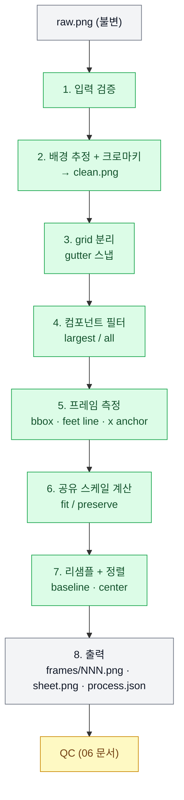

# 05. 스프라이트 후처리 파이프라인

## 1. 개요

파이프라인은 raw sheet 한 장과 액션 설정을 받아, 투명 배경의 정규화된 프레임 N장과 가로 한 줄 sheet를 만든다. **모든 단계가 결정적이다.** 같은 `raw.png`와 같은 파라미터면 같은 바이트가 나온다(PRD §31). 이미지 모델 출력의 해상도와 배경색은 가정하지 않는다([03](03-codex-image-provider.md) F4, F12).

단계는 아래 순서로 실행된다. 배경 제거를 grid 분리보다 먼저 하는 이유는, 칸 경계를 찾을 때 "배경만 있는 띠(gutter)"를 알파 채널로 판별하기 때문이다.



좌표 표기: raw 이미지 크기 `W×H`, raw cell 크기 `RW×RH`, 출력 cell 크기 `CW×CH`(기본 128×128), 여백 `m_top`, `m_side`, `m_bottom`(기본 8, 8, 10), baseline `B = CH − m_bottom`(기본 118).

---

## 2. 입력 검증

| 검사 | 기준 | 실패 시 |
|---|---|---|
| 디코드 | Pillow로 열림 | `invalid_image` |
| 모드 | RGB 또는 RGBA. 그 외 모드(P, L 등)는 RGB로 변환 | — |
| 최소 크기 | `min(W, H) ≥ 256` | `too_small` |
| raw cell 크기 | `RW = W / cols ≥ 96`, `RH = H / rows ≥ 96` | `cell_too_small` |

raw가 이미 RGBA이고 테두리 픽셀의 알파가 전부 0이면(모델이 진짜 투명 배경을 낸 경우) 2단계 크로마키를 건너뛰고 알파를 그대로 쓴다. `process.json`에 `background.mode = "native_alpha"`로 기록한다.

---

## 3. 배경 제거

### 3.1 배경색 추정

요청한 키 색이 아니라 **이미지 테두리에서 실제 배경색을 샘플링**한다(ADR-005). 실측에서 모델은 #FF00FF를 정확히 내지 않았다(정확 일치 0%, 평균 (250, 3, 250)과 (246, 5, 248)).

- 테두리 띠 폭 `b = max(2, round(0.01 × min(W, H)))`
- 네 변의 띠에 속한 픽셀의 채널별 **중앙값**을 배경색 `bg`로 쓴다
- 중앙값을 쓰는 이유: 칸 경계에 캐릭터가 걸쳐 테두리에 일부 전경이 섞여도 영향이 작다

`‖bg − key‖ > 60`이면 모델이 다른 배경을 낸 것이다. 처리는 계속하되 QC-09 경고를 남긴다.

### 3.2 알파 계산

각 픽셀의 RGB 유클리드 거리 `d = ‖rgb − bg‖`로 알파를 정한다. 두 임계값 사이는 선형 램프로 부드럽게 만든다.

```text
alpha = 0                                  if d ≤ t_in
alpha = 255 × (d − t_in) / (t_out − t_in)  if t_in < d < t_out
alpha = 255                                if d ≥ t_out
```

| 파라미터 | 기본값 | 근거 |
|---|---|---|
| `t_in` | 30 | 실측 배경 픽셀의 99%가 샘플 배경색과 거리 11 이내, 모서리 최대 약 40([03](03-codex-image-provider.md) F13). 30이면 거의 모든 배경을 덮고, 남는 모서리 잡티는 4단계 컴포넌트 필터가 제거 |
| `t_out` | 90 | 거리 20~120 전이 픽셀이 0.3% 미만이라 넓은 램프가 필요 없음. 캐릭터 색이 키 색에 가까우면 반투명해지므로 §3.4 충돌 규칙으로 예방 |

PRD §13의 `tolerance: 20`은 "#FF00FF 기준 20"이었으므로 실측 데이터에서는 모서리 배경이 남는다. 이 문서의 기준을 따른다.

배경 제거는 flood fill이 아니라 **전역 거리 기반**이다. 팔과 몸 사이처럼 닫힌 공간에 갇힌 배경도 제거된다.

### 3.3 가장자리 despill

키 색이 가장자리 반투명 픽셀에 번진 색(spill)을 줄인다. 가장자리 띠에만 적용한다. 전체에 적용하면 분홍 피부 같은 정상 색이 바뀌기 때문이다.

- 가장자리 띠: `alpha > 0`이면서 `alpha == 0` 픽셀로부터 `edge_band_px`(기본 2) 이내인 픽셀
- magenta 키: `s = max(0, min(R, B) − G)` → `R −= s`, `B −= s`
- green 키: `s = max(0, G − max(R, B))` → `G −= s`

빨간색(200, 40, 30)은 `min(R, B) − G = 30 − 40 < 0`이라 변하지 않는다.

### 3.4 키 색 충돌 규칙

plan 생성 시 profile의 `primary_colors`·`secondary_colors` 중 하나라도 `#FF00FF`와의 거리가 120 미만이면 키 색을 `#00FF00`으로 바꾼다. 두 색 모두 충돌하면 `#FF00FF`를 유지하고 plan의 `assumptions`에 경고를 남긴다. 이 규칙은 생성 전에 적용되므로 프롬프트의 BACKGROUND RULE에도 반영된다.

### 3.5 출력

알파가 적용된 전체 sheet를 `clean.png`(RGBA)로 저장한다. Web UI의 "정리된 시트" 탭이 이 파일을 보여준다.

---

## 4. Grid 분리

### 4.1 이상적 경계

행 경계 `y_i = round(i × H / rows)`, 열 경계 `x_j = round(j × W / cols)`에서 시작한다.

### 4.2 gutter 스냅

모델은 칸을 정확히 등분하지 않는다. 캐릭터가 이상적 경계에 걸치지 않았다면 그 근처에 **알파가 전부 0인 띠**가 있다([03](03-codex-image-provider.md) F14). 경계를 그 띠의 중앙으로 옮긴다.

1. 가로 경계(행 사이)를 먼저 정한다. 각 내부 경계 `y_i`에 대해 `±0.06 × H` 창 안에서 "행 전체의 알파가 0"인 연속 구간을 찾는다.
2. 이상적 경계를 포함하는 구간이 있으면 그 구간 중앙을, 없으면 가장 가까운 구간 중앙을 경계로 쓴다.
3. 창 안에 구간이 없으면 이상적 경계를 그대로 쓰고, 경계에 닿는 두 칸에 `gutter_missing` 표시를 남긴다(QC-01에서 실패 처리).
4. 세로 경계(열 사이)는 **행 띠마다 따로** 같은 방식으로 정한다. 윗줄과 아랫줄의 캐릭터 위치가 다를 수 있기 때문이다.

실측 T2(1254×1254, 2x3)에 적용하면 다음과 같다.

| 경계 | 이상적 위치 | 발견된 gutter | 스냅 결과 |
|---|---:|---|---:|
| 행 1/2 | 627 | 586–645 | 615 |
| 열 1/2 | 418 | 405–429 | 417 |
| 열 2/3 | 836 | 799–845 | 822 |

(T2 값은 전체 이미지 기준 열 검사 결과이며, 실제 구현은 행 띠별로 계산한다.)

```
clean.png 알파 → 가로 경계 스냅(행 전체 기준) → 행 띠별 세로 경계 스냅 → 칸 사각형 목록
                        ↓ gutter 없음                  ↓ gutter 없음
                  이상적 경계 사용 + gutter_missing 표시(→ QC-01 실패)
```

### 4.3 사용할 칸

읽기 순서(row-major)로 앞의 `frames`개 칸만 프레임으로 쓴다. 나머지 칸은 무시한다.

---

## 5. 컴포넌트 필터

각 칸 안에서 전경 연결 요소를 찾아 노이즈를 제거한다(PRD §15).

- 마스크: `alpha ≥ 64`
- 라벨링: `scipy.ndimage.label`, 8-연결(`structure = ones((3, 3))`)

| 모드 | 규칙 | 용도 |
|---|---|---|
| `largest` | 가장 큰 요소 `main`을 남긴다. 추가로 면적 ≥ `main`의 1%이고, bbox 사이 간격이 `merge_gap_px` 이하인 요소도 남긴다. 나머지는 알파 0으로 지운다 | 캐릭터 body. 칼집·머리카락처럼 배경 틈으로 떨어진 부분을 살림 |
| `all` | 면적 ≥ `min_area_px`인 요소를 모두 남긴다 | FX, projectile, 파편 |

| 파라미터 | 기본값 |
|---|---|
| `merge_gap_px` | `max(4, round(0.02 × RH))` raw px |
| `min_area_px` | 16 raw px |

제거한 요소 수와 면적은 `process.json`에 기록한다. 제거 면적이 `main`의 5%를 넘으면 QC 정보 항목으로 표시한다(무기가 잘려 나갔을 가능성).

---

## 6. 프레임 측정

필터 후 마스크(`alpha ≥ 64`)에서 프레임마다 다음 값을 raw 좌표로 잰다.

| 값 | 정의 |
|---|---|
| `bbox` | `(x0, y0, x1, y1)`, 폭 `w`, 높이 `h` |
| `feet_y` | 아래에서 위로 훑어 처음으로 "행의 전경 픽셀 수 ≥ `k1`"인 행. `k1 = max(3, 0.02 × w)`. 가느다란 칼끝·머리카락 한 가닥을 무시함 |
| `feet_y_strict` | 같은 방식, `k2 = max(6, 0.08 × w)`. QC-03 교차 검증용 |
| `mass_cx` | 마스크 전체의 질량 중심 X |
| `feet_cx` | `feet_y`에서 위로 `0.12 × h` 높이 띠의 질량 중심 X |
| `bbox_cx`, `bbox_cy` | bbox 중심 |

anchor 점(정렬 기준 점)은 plan의 `anchor`·`x_anchor`로 고른다.

| `anchor` | anchor Y | 정렬 목표 Y |
|---|---|---|
| `feet` | `feet_y` | `B` |
| `bottom` | `y1` (bbox 하단) | `B` |
| `center` | `bbox_cy` | `CH / 2` |

| `x_anchor` | anchor X | 정렬 목표 X |
|---|---|---|
| `mass` | `mass_cx` | `CW / 2` |
| `feet` | `feet_cx` | `CW / 2` |
| `bbox` | `bbox_cx` | `CW / 2` |

---

## 7. 스케일

**한 액션의 모든 프레임에 같은 배율 `s`를 쓴다(공유 스케일).** 프레임마다 따로 맞추면 후처리가 스케일 드리프트를 만들어 낸다. PRD §21의 "Reprocess + shared_scale"은 이 파이프라인에서 기본 동작이다.

### 7.1 fit

모든 프레임이 anchor 기준으로 배치했을 때 여백 안에 들어가는 최대 배율이다. bbox 중앙이 아니라 **anchor 점 기준으로 좌우·상하 여유를 계산**해야 한다. anchor가 bbox 중앙이 아니기 때문이다(예: 칼을 앞으로 뻗은 공격).

```text
up_i    = anchor_y_i − y0_i            # anchor 위쪽 높이
down_i  = y1_i − anchor_y_i            # anchor 아래쪽 (망토 끝 등, 0 이상)
left_i  = anchor_x_i − x0_i
right_i = x1_i − anchor_x_i

s_fit = min(
  (B − m_top)            / max_i up_i,
  (CH − 1 − B)           / max_i down_i      (down이 0이면 제외),
  (CW / 2 − m_side)      / max_i max(left_i, right_i)
)
```

`anchor = center`인 경우 목표점이 `(CW/2, CH/2)`이므로 같은 식에서 `B`를 `CH/2`로, 아래쪽 여유를 `CH/2 − m_bottom`으로 바꾼다.

### 7.2 preserve

모델이 그린 캐릭터 크기를 raw cell 대비 비율로 유지한다(PRD §17). 긴 무기 때문에 bbox가 커져도 body가 작아지지 않는다.

```text
s_preserve = k_norm / RH
k_norm     = character-scale-profile.json 의 norm_scale (= 기준 액션의 s × 기준 액션의 RH)
```

- 이 식은 "모델이 모든 액션에서 캐릭터를 칸 높이 대비 같은 비율로 그린다"고 가정한다. 가정이 깨지면(모델이 칼을 넣으려고 캐릭터를 작게 그리면) QC-07이 잡는다. 그때는 재생성해야 하며, 재처리로는 고칠 수 없다.
- scale profile이 아직 없으면(첫 액션) `fit`으로 대체하고 `warnings`에 `no_scale_profile`을 남긴다.
- `s_preserve`로 배치했을 때 칸을 넘치면 **잘라내지 않는다.** 넘친 채로 합성하면 칸 밖 픽셀이 사라지므로, 합성 전에 넘침을 계산해 QC-01(출력 경계) 실패로 보고한다. 권장 조치는 FX 분리, cell 확대, 또는 fit 전환이다([06](06-qc-and-recovery.md)).

### 7.3 리샘플

| 조건 | 방법 |
|---|---|
| `art_style`이 `pixel_art` / `retro_pixel` | `Image.BOX` 축소 후 알파 이진화(`alpha ≥ 128 → 255`, 그 외 0). 반투명 가장자리 제거 |
| 그 외 | 프리멀티플라이드 알파(`RGBa`)로 변환 → `Image.LANCZOS` → `RGBA`로 복원 |

프리멀티플라이 변환을 명시하는 이유: 투명 픽셀의 RGB(키 색)가 보간에 섞이면 가장자리에 분홍 테두리가 생긴다. Pillow 내부 처리에 기대지 않고 명시적으로 변환한다.

AI가 그린 "픽셀 아트"는 실제 픽셀 격자에 맞지 않는다. BOX 축소는 격자를 복원하지 못하므로, 진짜 픽셀 아트 품질(팔레트 양자화, 격자 정렬)은 Phase 2 과제로 둔다.

---

## 8. 정렬과 합성

1. 필터된 칸 이미지를 bbox로 자르고(`+2px` 여유) 배율 `s`로 리샘플한다.
2. 리샘플 후의 anchor 점 좌표 `(ax', ay')`를 계산한다.
3. 목표점에 맞도록 정수 오프셋 `dx = floor(CW/2 − ax' + 0.5)`, `dy = floor(target_y − ay' + 0.5)`를 구해 `CW×CH` 투명 캔버스에 붙인다.
4. 반올림 오차는 최대 0.5px이다. 서브픽셀 이동은 하지 않는다(재리샘플로 인한 흐림 방지).

```
칸 이미지 → bbox 크롭(+2px) → 배율 s로 리샘플 → anchor 점 재계산 → 정수 오프셋 계산 → CW×CH 투명 캔버스에 붙이기
```

---

## 9. 출력

| 파일 | 내용 |
|---|---|
| `clean.png` | 배경이 제거된 전체 raw sheet (RGBA, raw 해상도) |
| `frames/000.png` … | 정규화된 프레임. `CW×CH` RGBA |
| `sheet.png` | 프레임을 **가로 한 줄**로 이어 붙인 sheet. `(N × CW) × CH`. Phaser `load.spritesheet`에 frameWidth/frameHeight만으로 로드 가능 |
| `process.json` | 입력 해시, 모든 파라미터, 중간 계산값, 출력 해시 |

`process.json` 예시(요지). 행 경계와 첫 행 열 경계는 T2 실측값이고, 나머지 수치는 형식 설명용이다.

```json
{
  "schema_version": 1,
  "pipeline_version": "sprite_forge@0.1.0",
  "raw": { "file": "raw.png", "sha256": "…", "width": 1254, "height": 1254 },
  "params": {
    "grid": "2x3", "frames": 6,
    "cell": { "w": 128, "h": 128 }, "margin": { "top": 8, "side": 8, "bottom": 10 },
    "background": { "mode": "chroma", "key_color": "#FF00FF", "t_in": 30, "t_out": 90, "despill": true, "edge_band_px": 2 },
    "components": { "mode": "largest", "merge_gap_px": 13, "min_area_px": 16 },
    "anchor": "feet", "x_anchor": "mass", "scale_strategy": "fit", "resample": "lanczos"
  },
  "derived": {
    "bg_color": [246, 5, 248],
    "bg_distance_to_key": 12.4,
    "row_boundaries": [0, 615, 1254],
    "col_boundaries": [[0, 417, 822, 1254], [0, 419, 820, 1254]],
    "scale": 0.2143,
    "baseline_y": 118,
    "frames": [
      { "index": 0, "cell": [0, 0, 417, 615], "bbox": [20, 48, 330, 583], "feet_y": 580, "feet_y_strict": 578,
        "anchor": [172.4, 580], "offset": [27, 0], "removed_components": 2, "removed_area": 31 }
    ]
  },
  "outputs": {
    "clean.png": "sha256:…", "sheet.png": "sha256:…",
    "frames/000.png": "sha256:…"
  },
  "warnings": []
}
```

`derived` 값은 Web UI가 raw 위에 경계선·bbox·anchor 점을 그리는 데 쓴다. 디버그 이미지를 따로 만들지 않는다.

---

## 10. 결정성 규칙

| 규칙 | 이유 |
|---|---|
| 난수 사용 금지 | — |
| 반올림은 `floor(x + 0.5)` 하나로 통일 | Python `round()`의 은행가 반올림과 혼용 방지 |
| 부동소수 비교 전 소수 4자리로 반올림 | 플랫폼 간 마지막 비트 차이 흡수 |
| PNG 저장 옵션 고정(`optimize=False`, `compress_level=6`), 메타데이터 청크 미기록 | 같은 픽셀이면 같은 바이트 |
| Pillow·NumPy·SciPy 버전은 lockfile로 고정 | 리샘플 구현 차이 방지 |
| 결정성 테스트: 같은 입력으로 두 번 처리해 모든 출력 sha256 비교 | [11](11-testing.md) |

"동일 결과"의 범위는 **같은 OS·같은 lockfile**이다. 서로 다른 CPU 아키텍처 간 바이트 동일성은 보장하지 않는다(LANCZOS 부동소수 연산 차이 가능) [중간].

---

## 11. 성능 목표

Web UI에서 슬라이더로 파라미터를 바꾸며 재처리하므로 빨라야 한다.

| 항목 | 목표 (Apple Silicon 기준) |
|---|---|
| 1254×1254, 6프레임 액션 1회 처리 | 2초 이내 |
| 크로마키 단계 | NumPy 벡터 연산만 사용(픽셀 루프 금지) |
| 재처리 시 캐시 | `raw.png` sha256 + 배경 파라미터가 같으면 `clean.png`를 재사용 |
