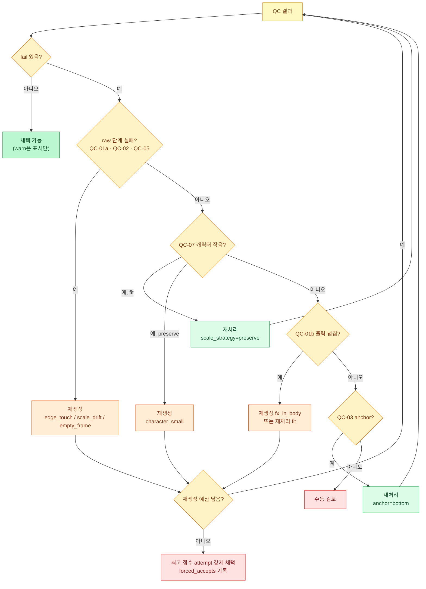

# 06. 품질 검사(QC)와 자동 복구

## 1. 원칙

- QC는 **생성된 그림을 게임 asset으로 쓸 수 있는지** 판정한다(PRD §38 핵심 가치 2).
- 모든 검사는 결정적이다. 같은 `process.json` 입력이면 같은 결과가 나온다.
- 등급은 세 가지다. `fail`(채택 전 복구 필요), `warn`(채택 가능, 사용자에게 표시), `info`(기록만).
- **정렬에 쓴 값을 정렬 후 다시 재는 검사는 무의미하다.** 그래서 QC-03·QC-04는 정렬에 쓰지 않은 독립 지표로 잰다.
- QC는 복구를 **권장**할 뿐 실행하지 않는다. 실행은 Agent(Skill 모드) 또는 사용자(Web UI)가 결정한다.

---

## 2. 검사 항목

| ID | 이름 | 측정 시점 | 지표 | fail | warn |
|---|---|---|---|---|---|
| QC-01 | 경계 침범 | raw 칸 + 출력 | (a) raw: 칸 경계 2px 이내 전경 픽셀 존재 또는 `gutter_missing` / (b) 출력: 배치 결과가 출력 cell 밖으로 넘침 또는 가장자리 1px에 닿음 | (a)·(b) 중 하나라도 | — |
| QC-02 | 스케일 드리프트 | raw | `(max h − min h) / median h` (bbox 높이) | > 0.10 | > 0.05 |
| QC-03 | Anchor 드리프트 | 출력 | `max_i |feet_y_strict_i − B|` (px). 정렬은 `feet_y`(약한 임계)로 했으므로 강한 임계 추정기로 교차 검증 | > 3px | > 2px |
| QC-04 | Center 드리프트 | 출력 | 정렬에 쓰지 않은 X 지표의 편차. `x_anchor=mass`면 `feet_cx`, `x_anchor=feet`면 `mass_cx`. `max_i |x_i − median x|` | — | > 0.08 × CW |
| QC-05 | 빈 프레임 | raw 칸 | 필터 후 전경 면적 / 칸 면적 | < 0.005 | — |
| QC-06 | 중복 프레임 | 출력 | 인접 프레임(loop면 마지막→첫 프레임 포함) dHash 해밍 거리 | — | ≤ 2 |
| QC-07 | 캐릭터 스케일 | 출력 | `median h / profile.body_height` | < 0.85 | < 0.92 또는 > 1.20 |
| QC-08 | Reference 일관성 | — | Phase 2(비전 모델 점수). MVP는 Web UI 수동 확인 | — | — |
| QC-09 | 배경 키 일치 | raw | `‖bg_color − key_color‖` | — | > 60 |

### 2.1 세부 정의

- **QC-01 (a)**: 칸 경계에서 안쪽으로 2 raw px 띠 안에 `alpha ≥ 64` 픽셀이 하나라도 있으면 해당 칸 실패. 이미지 외곽 테두리도 포함한다(외곽에 닿았다는 건 캐릭터가 이미지 밖으로 잘렸다는 뜻).
- **QC-01 (b)**: 합성 전에 배치 사각형을 계산해 판정한다. `preserve`에서 칼이 cell을 넘는 경우가 대표적이다.
- **QC-02**: 모델이 프레임마다 캐릭터를 다른 크기로 그렸는지 본다. 공유 스케일은 비율을 보존하므로 raw에서 재도 출력에서 재도 같다.
- **QC-06 dHash**: 프레임을 회색(128) 배경에 합성 → 그레이스케일 → `Image.BOX`로 9×8 축소 → 가로 인접 픽셀 비교로 64비트 해시.
- **QC-07**: Character Scale Profile(§5)이 있어야 실행한다. 없으면 `not_run`.

### 2.2 알려진 한계

- QC-07은 bbox 높이를 쓰므로 **머리 위로 든 무기가 body 축소를 가릴 수 있다.** attack의 body가 작아져도 칼 때문에 bbox 높이가 유지되면 통과한다. MVP 완화책은 Web UI의 "idle 겹쳐 보기"(같은 배율로 idle 첫 프레임을 반투명하게 겹침)로 사람이 확인하는 것이다. 근본 해결은 Phase 2의 비전 기반 QC-08이다.
- QC-06은 모델이 동작을 너무 작게 그린 경우(T1 idle이 이런 경향을 보였다)를 잡지만 동작의 자연스러움은 판단하지 않는다. 동작 의미 검증은 Phase 2 "Animation Semantic QC"다.

---

## 3. 적용 매트릭스

액션마다 포즈 특성이 달라 모든 검사를 똑같이 적용하면 오탐이 생긴다. 예를 들어 death는 마지막에 누우므로 높이가 크게 줄고, jump는 웅크렸다 펴므로 높이가 변한다. QC profile(02 §6)별로 적용 여부를 정한다.

| 검사 | locomotion (idle, walk, run) | action (attack, shoot, cast, hurt) | airborne (jump, fall) | terminal (death) | fx |
|---|---|---|---|---|---|
| QC-01 | 적용 | 적용 | 적용 | 적용 | 적용 |
| QC-02 | 적용 | warn만 (> 0.20) | 미적용 | 미적용 | 미적용 |
| QC-03 | 적용 | 적용 | 적용 | 미적용 (anchor=bottom) | 미적용 |
| QC-04 | 적용 | info | 적용 | 미적용 | 미적용 |
| QC-05 | 적용 | 적용 | 적용 | 적용 | 적용 |
| QC-06 | idle은 info, 그 외 적용 | 적용 | 적용 | 적용 | 적용 |
| QC-07 | walk, run 적용 (idle은 기준이므로 미적용) | 적용 | 미적용 | 미적용 | 미적용 |
| QC-09 | 적용 | 적용 | 적용 | 적용 | 적용 |

---

## 4. 결과 형식

### 4.1 액션별 `qc-report.json`

PRD §20 형식을 확장했다. `checks`는 PRD 필드명을 유지하고, 등급과 권장 조치를 추가했다.

```json
{
  "schema_version": 1,
  "action": "attack",
  "attempt": "002",
  "status": "fail",
  "score": 75,
  "frames": 6,
  "checks": {
    "edge_touch": false,
    "scale_variance": 0.042,
    "anchor_variance": 1.0,
    "duplicate_frames": [],
    "empty_frames": []
  },
  "results": [
    { "id": "QC-01", "grade": "pass" },
    { "id": "QC-02", "grade": "pass", "value": 0.042, "limit": { "warn": 0.20 } },
    { "id": "QC-03", "grade": "pass", "value": 1.0, "limit": { "warn": 2, "fail": 3 } },
    { "id": "QC-04", "grade": "info", "value": 9.5 },
    { "id": "QC-05", "grade": "pass" },
    { "id": "QC-06", "grade": "pass", "pairs": [] },
    { "id": "QC-07", "grade": "fail", "value": 0.81, "limit": { "fail": 0.85, "warn": 0.92 },
      "message": "attack 캐릭터 높이가 idle 대비 81%" },
    { "id": "QC-08", "grade": "not_run" },
    { "id": "QC-09", "grade": "pass", "value": 10.7 }
  ],
  "per_frame": [
    { "index": 0, "bbox_h": 96, "feet_y_strict": 118, "x_metric": 63.0, "dhash": "f0e1c3…" }
  ],
  "recommendations": [
    { "type": "reprocess", "code": "use_preserve", "set": { "scale_strategy": "preserve" },
      "reason": "fit 전략에서 무기 때문에 body가 축소됨", "cost": "~2s" },
    { "type": "regenerate", "code": "character_small",
      "reason": "preserve로도 부족하면 body 크기 유지 문구로 재생성", "cost": "~90s" }
  ]
}
```

### 4.2 점수와 최선 attempt 선택

`score = max(0, 100 − 25 × fail 개수 − 8 × warn 개수)`. 복구 예산을 다 써서 강제로 채택해야 할 때는 점수가 가장 높은 attempt를 고르고, 동점이면 QC-02 값이 작은 쪽, 그다음 최신 attempt를 고른다.

### 4.3 캐릭터 단위 `qc-report.json`

export 시 루트에 액션별 결과를 모은다(PRD §39).

```json
{
  "schema_version": 1,
  "character": "hero",
  "status": "warn",
  "actions": {
    "idle":   { "attempt": "001", "status": "pass", "score": 100 },
    "walk":   { "attempt": "001", "status": "pass", "score": 100 },
    "run":    { "attempt": "002", "status": "warn", "score": 92, "warnings": ["QC-02"] },
    "attack": { "attempt": "003", "status": "pass", "score": 100 }
  },
  "forced_accepts": []
}
```

---

## 5. Character Scale Profile

첫 번째로 채택된 body 액션(보통 idle)에서 만든다(PRD §18). 이후 액션의 QC-07과 `preserve` 배율의 기준이 된다.

```json
{
  "schema_version": 1,
  "character": "hero",
  "reference_action": "idle",
  "reference_attempt": "001",
  "target_cell": [128, 128],
  "baseline_y": 118,
  "body_height": 104,
  "body_width": 62,
  "feet_y": 118,
  "center_x": 64,
  "norm_scale": 131.1,
  "raw_cell_height": 627
}
```

- `body_height`, `body_width`: 기준 액션 출력 프레임 bbox의 중앙값
- `norm_scale = s × RH` (기준 액션의 배율 × raw cell 높이). preserve 배율 계산에 쓴다([05](05-sprite-pipeline.md) §7.2)
- 기준 액션을 다시 채택하면 profile이 갱신된다. 이미 채택된 다른 액션의 QC는 **다시 계산해 표시**하지만 자동으로 재처리하지는 않는다

---

## 6. 복구 규칙

QC 실패마다 권장 조치 목록을 우선순위대로 만든다. 싼 조치(재처리, 약 2초)를 비싼 조치(재생성, 약 90초)보다 먼저 권장한다. 단, 재처리로 원리상 고칠 수 없는 실패(raw 단계 문제)는 바로 재생성을 권장한다.

| 우선 | 실패 | 원인 | 1순위 조치 | 2순위 조치 |
|---:|---|---|---|---|
| 1 | QC-05 빈 프레임 | 모델이 칸을 비움 | 재생성 `empty_frame` | — |
| 2 | QC-01 (a) raw 경계 침범 | 캐릭터가 칸 경계에서 잘림. 재처리로 복원 불가 | 재생성 `edge_touch` (margin 15%) | — |
| 3 | QC-07 캐릭터 작음 (fit) | bbox fit이 무기 때문에 body 축소 | 재처리 `scale_strategy=preserve` | 재생성 `character_small` |
| 4 | QC-07 캐릭터 작음 (preserve) | 모델이 작게 그림 | 재생성 `character_small` | 재생성 `fx_in_body` |
| 5 | QC-01 (b) 출력 넘침 (preserve) | 무기·FX가 cell보다 큼 | 재생성 `fx_in_body` | 재처리 `scale_strategy=fit` (QC-07 재확인 필요) |
| 6 | QC-02 스케일 드리프트 | 모델이 프레임마다 다른 크기로 그림. 공유 스케일은 비율을 보존하므로 재처리 무효 | 재생성 `scale_drift` | — |
| 7 | QC-03 Anchor 드리프트 | feet line이 망토 끝·무기 등에 걸림 | 재처리 `anchor=bottom` | 재처리 `components=largest, merge_gap_px ×0.5` |
| 8 | QC-09 배경 불일치 (warn) | 모델이 다른 배경색 사용 | QC-01·05도 실패일 때만 재생성 `bg_mismatch` | — |
| 9 | QC-06 중복 (warn) | 동작이 너무 작음 | 자동 조치 없음. Web UI에서 재생성 `duplicate_frames` 버튼 제공 | — |

재처리가 권장되면 `set`에 바꿀 파라미터가, 재생성이 권장되면 `code`에 [04](04-prompt-rules.md) §6 복구 코드가 들어간다.



### 6.1 복구 예산

| 모드 | 재처리 | 재생성 | 예산 소진 시 |
|---|---:|---:|---|
| Skill (Agent 자동) | 액션당 2회 | 액션당 2회 | 최고 점수 attempt 강제 채택, 보고서에 명시 |
| Web UI 수동 | 제한 없음 | 제한 없음(버튼마다 예상 시간 표시) | — |
| Web UI 일괄 생성 | 액션당 2회(자동) | 액션당 `max_regenerations`(기본 1) | 해당 액션을 "검토 필요"로 두고 다음 액션 진행 |

---

## 7. Body와 FX 분리

PRD §22의 분리는 두 단계로 나눠 구현한다.

- **MVP**: plan에 FX를 별도 항목(예: `slash_fx`, `kind: "fx"`)으로 추가할 수 있다. FX는 `components=all`, `anchor=center`, `scale_strategy=fit`, QC profile `fx`로 처리한다. body 쪽은 복구 코드 `fx_in_body`로 이펙트 없이 재생성한다.
- **MVP 이후(P1)**: QC-01(b)나 QC-07 실패 원인이 FX로 추정되면 recovery가 "body 재생성 + FX sheet 신규 생성" 조합을 자동으로 권장한다. FX 추정 휴리스틱(색상 채도·면적 분포 기반)은 실제 실패 사례를 모은 뒤 정한다.

FX 파일은 `fx/<name>/` 아래 액션과 같은 구조로 저장하고, atlas에는 `<name>_<i>` 프레임으로 들어간다.
