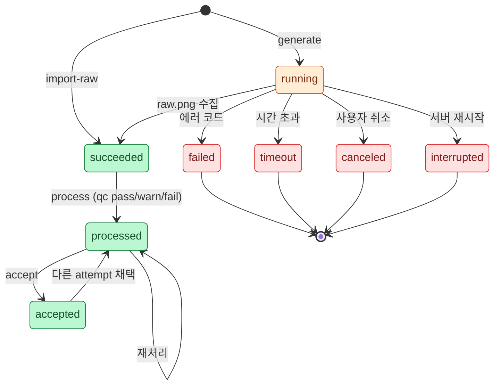

# 08. 데이터 모델 (디렉터리 · 파일 · 스키마)

## 1. 원칙

- **파일 시스템이 유일한 상태 저장소다**(ADR-003). Web UI 서버는 메모리에 Job 큐만 들고, 나머지는 전부 이 디렉터리에서 읽는다. 서버를 재시작해도, Skill과 Web UI를 번갈아 써도 상태가 유지된다.
- **원본은 불변이다**(PRD §31 Non-destructive). `raw.png`와 생성 기록은 한 번 쓰면 바꾸지 않는다. 재생성은 항상 새 attempt를 만든다.
- **파생 파일은 덮어써도 된다.** `clean.png`, `frames/`, `process.json` 등은 `raw.png` + 파라미터로 언제든 다시 만들 수 있기 때문이다.
- MVP에는 **삭제 명령이 없다.** 정리가 필요하면 사용자가 디렉터리를 직접 지운다.

---

## 2. 디렉터리 구조

기본 루트는 `./sprites/`(`--root` 또는 환경 변수 `SPRITE_FORGE_ROOT`로 변경)이다.

```text
sprites/
└── hero/                                  # character_id
    ├── manifest.json
    ├── animation-plan.json
    ├── character-profile.json
    ├── character-scale-profile.json       # 첫 body 액션 채택 시 생성
    ├── animations.json                    # export
    ├── qc-report.json                     # export (캐릭터 단위 집계)
    │
    ├── reference/
    │   ├── source.png                     # 업로드 원본 (불변, 원래 확장자 유지)
    │   ├── character.png                  # 투명 배경 canonical reference
    │   ├── character-keyed.png            # 키 색 배경, 긴 변 ≤1024px (Codex 첨부용)
    │   ├── identity-raw.json              # Codex 분석 원본 응답
    │   └── attempts/                      # Case B: 텍스트로 reference 생성 시도
    │       └── 001/ …                     # 액션 attempt와 같은 구조 (grid 1x1)
    │
    ├── idle/
    │   ├── raw.png                        # ┐
    │   ├── clean.png                      # │
    │   ├── sheet.png                      # │ 채택된 attempt의 복사본
    │   ├── process.json                   # │ (accept 시 덮어씀)
    │   ├── qc-report.json                 # │
    │   ├── frames/000.png …               # ┘
    │   └── attempts/
    │       ├── 001/
    │       │   ├── prompt.txt             # 불변
    │       │   ├── ref-01.png             # 불변 (첨부한 reference 사본)
    │       │   ├── raw.png                # 불변
    │       │   ├── generation.json        # 불변 (생성 완료 시 1회 기록)
    │       │   ├── codex-events.jsonl     # 불변
    │       │   ├── codex-stderr.txt       # 불변
    │       │   ├── codex-last-message.txt # 불변
    │       │   ├── clean.png              # 파생
    │       │   ├── process.json           # 파생
    │       │   ├── qc-report.json         # 파생
    │       │   ├── sheet.png              # 파생
    │       │   └── frames/000.png …       # 파생
    │       └── 002/ …
    │
    ├── walk/ run/ attack/ …
    ├── fx/
    │   └── slash_fx/ …                    # 액션과 같은 구조
    ├── atlas/
    │   ├── hero.png
    │   ├── hero.json
    │   ├── hero.generic.json
    │   └── hero.meta.json
    └── preview/
        └── idle.gif …
```

---

## 3. 파일별 책임

| 파일 | 생성 명령 | 불변 | 설명 |
|---|---|---|---|
| `manifest.json` | 모든 쓰기 명령 | 아니오 | 캐릭터 전체 상태·이력·해시 |
| `animation-plan.json` | `plan` | 아니오 | [02](02-skill-spec.md) §8 |
| `character-profile.json` | `identity analyze`, Web UI 편집 | 아니오 | §5.2 |
| `character-scale-profile.json` | 첫 body 액션 `accept` | 아니오 | [06](06-qc-and-recovery.md) §5 |
| `reference/source.*` | `reference import` | **예** | 업로드 원본 |
| `reference/character*.png` | `reference import`/`select` | 아니오 | canonical reference |
| `attempts/NNN/prompt.txt` | `generate` | **예** | 실제 사용한 프롬프트 |
| `attempts/NNN/raw.png` | `generate`, `import-raw` | **예** | 원본 생성 이미지 |
| `attempts/NNN/generation.json` | `generate`, `import-raw` | **예** | [03](03-codex-image-provider.md) §6.3 |
| `attempts/NNN/codex-*` | `generate` | **예** | Codex 실행 로그 |
| `attempts/NNN/{clean,sheet}.png`, `frames/` | `process` | 아니오 | [05](05-sprite-pipeline.md) §9 |
| `attempts/NNN/process.json` | `process` | 아니오 | 마지막 처리 파라미터와 결과 |
| `attempts/NNN/qc-report.json` | `process` | 아니오 | [06](06-qc-and-recovery.md) §4.1 |
| `<action>/*` (최상위) | `accept` | 아니오 | 채택본 복사 |
| `atlas/*`, `animations.json`, `preview/*`, 루트 `qc-report.json` | `export` | 아니오 | [07](07-export.md) |

---

## 4. 식별자와 명명 규칙

| 대상 | 규칙 | 예 |
|---|---|---|
| character_id | `^[a-z0-9][a-z0-9-]{0,39}$` | `hero`, `red-knight` |
| action 이름 | `^[a-z][a-z0-9_]{0,31}$`. 프리셋 이름 또는 custom | `idle`, `slash_fx`, `victory_pose` |
| attempt 번호 | 3자리 0 채움, 액션별 단조 증가, 최대 999 | `001` |
| 프레임 파일 | 3자리 0 채움, 0부터 | `frames/000.png` |
| atlas 프레임 이름 | `<action>_<index>`, 0부터 | `walk_5` |

attempt 번호는 `os.mkdir`의 원자성으로 할당한다. 가장 큰 기존 번호 + 1로 만들기를 시도하고, 이미 있으면(동시 생성) 다음 번호로 재시도한다.

---

## 5. 스키마

JSON Schema 파일은 `sprite-animation-forge/schemas/`에 둔다. 모든 파일에 `schema_version`(정수)을 넣고, 호환되지 않는 변경 시 올린다. 아래는 필드 정의 요약이다.

### 5.1 `animation-plan.json`

| 필드 | 타입 | 필수 | 설명 |
|---|---|---|---|
| `character` | string | ✓ | character_id |
| `asset_type` | enum | ✓ | player, npc, character, creature, enemy |
| `view` | enum | ✓ | side, topdown, 3/4, front, rear |
| `facing` | enum | ✓ | right, down, down-right, camera, away |
| `art_style` | enum | ✓ | auto, pixel_art, retro_pixel, pixel_inspired, clean_hd, project_native |
| `cell` | `{w, h}` | ✓ | 출력 cell. 기본 128×128 |
| `margin` | `{top, side, bottom}` | ✓ | 기본 8, 8, 10 |
| `key_color` | hex | ✓ | `#FF00FF` 또는 `#00FF00` |
| `engine` | enum | ✓ | generic, phaser |
| `actions` | map | ✓ | 이름 → 액션 설정 |
| `actions.*.kind` | enum | | `body`(기본) 또는 `fx` |
| `actions.*.frames` | int 2–16 | ✓ | |
| `actions.*.grid` | `^\d+x\d+$` | ✓ | RxC |
| `actions.*.loop` | bool | ✓ | |
| `actions.*.fps` | int 1–60 | ✓ | |
| `actions.*.anchor` | enum | ✓ | center, bottom, feet |
| `actions.*.x_anchor` | enum | ✓ | mass, feet, bbox |
| `actions.*.scale_strategy` | enum | ✓ | fit, preserve |
| `actions.*.components` | enum | ✓ | largest, all |
| `actions.*.qc_profile` | enum | | locomotion, action, airborne, terminal, fx. 생략 시 액션 이름으로 결정 |
| `actions.*.motion` | string | custom 액션만 필수 | 모션 설명(영어). 프롬프트 ACTION 블록에 들어감 |
| `actions.*.poses` | string[] | | 프레임별 포즈. 생략 시 모션 라이브러리 또는 일반 규칙 |
| `order` | string[] | ✓ | 생성·atlas 행 순서 |
| `assumptions` | string[] | | 추론한 값과 근거 |

### 5.2 `character-profile.json`

PRD §8의 identity 필드를 그대로 쓴다. 모르는 값은 빈 문자열이나 빈 배열로 둔다(프롬프트에서 해당 줄이 빠진다).

```json
{
  "schema_version": 1,
  "source": "codex-analysis",
  "edited_by_user": false,
  "identity": {
    "silhouette": "small chibi knight with a tall pointed hood and a long tattered cape",
    "body_ratio": "short and stocky",
    "head_ratio": "about 1:2.5",
    "hair": "",
    "face": "hidden by a steel visor helmet with three vertical slits",
    "eyes": "",
    "clothing": "red pointed hood, red scarf-cape, steel plate armor, beige tunic with red stripes, brown belt with pouch",
    "primary_colors": ["#C8281E", "#9A9CA0"],
    "secondary_colors": ["#E8D2A8", "#6B3F1F"],
    "weapon": "sheathed sword with a gold pommel, worn on the back",
    "accessories": ["leather pouch"],
    "outline_style": "dark brown outline",
    "shading_style": "soft painted cel shading",
    "camera_angle": "side view",
    "orientation": "facing right"
  }
}
```

Codex `--output-schema`에 넘기는 `character-profile.llm.schema.json`은 `identity` 객체만 정의하고, 모든 속성을 `required`, `additionalProperties: false`로 둔다([03](03-codex-image-provider.md) §9).

### 5.3 `character-scale-profile.json`

[06](06-qc-and-recovery.md) §5 참고.

### 5.4 `generation.json`

[03](03-codex-image-provider.md) §6.3 참고. `import-raw`로 등록한 경우 `provider: "manual"`, `source_image`에 원래 경로, Codex 관련 필드는 `null`.

### 5.5 `process.json`

[05](05-sprite-pipeline.md) §9 참고.

### 5.6 `qc-report.json`

[06](06-qc-and-recovery.md) §4 참고.

### 5.7 `manifest.json`

```json
{
  "schema_version": 1,
  "character": "hero",
  "created_at": "2026-09-30T13:10:00Z",
  "updated_at": "2026-09-30T13:40:12Z",
  "tool": { "name": "sprite-animation-forge", "version": "0.1.0" },
  "reference": {
    "mode": "attached_image",
    "source": "reference/source.png",
    "source_sha256": "…",
    "selected_attempt": null
  },
  "assumptions": ["view=side (요청에 '횡스크롤' 포함)"],
  "actions": {
    "idle": {
      "kind": "body",
      "accepted_attempt": "001",
      "forced": false,
      "attempts": {
        "001": {
          "created_at": "2026-09-30T13:12:03Z",
          "provider": "codex-cli",
          "generation_status": "succeeded",
          "qc_status": "pass",
          "score": 100,
          "recovery": [],
          "extra": null
        }
      }
    },
    "attack": {
      "kind": "body",
      "accepted_attempt": null,
      "forced": false,
      "attempts": {
        "001": { "provider": "codex-cli", "generation_status": "succeeded", "qc_status": "fail", "score": 75, "recovery": [], "extra": null },
        "002": { "provider": "codex-cli", "generation_status": "running", "qc_status": null, "score": null, "recovery": ["character_small"], "extra": null }
      }
    }
  },
  "exports": {
    "phaser": {
      "exported_at": "2026-09-30T13:40:12Z",
      "files": { "atlas/hero.png": "sha256:…", "atlas/hero.json": "sha256:…", "animations.json": "sha256:…" }
    }
  },
  "usage": { "codex_calls": 7, "input_tokens": 812345, "cached_input_tokens": 701230, "output_tokens": 5123 }
}
```

---

## 6. Attempt 상태 전이

attempt는 생성 상태(`generation_status`)와 QC 상태(`qc_status`)를 따로 가진다. 생성이 끝나야 처리할 수 있고, 처리가 끝나야 채택할 수 있다. 서버가 `running` 도중 죽으면 재시작 시 `interrupted`로 바꾼다.



`processed`와 `accepted`는 manifest에서 `qc_status`와 `accepted_attempt`로 표현한다(별도 필드 없음).

---

## 7. 동시 쓰기

Skill CLI와 Web UI 서버가 같은 캐릭터 디렉터리를 동시에 쓸 수 있다.

| 대상 | 방법 |
|---|---|
| `manifest.json` | `fcntl.flock`으로 `manifest.lock` 배타 잠금 → 읽기-수정-쓰기 → 임시 파일에 쓰고 `os.replace` |
| attempt 디렉터리 | `attempts/NNN/.lock` 잠금 후 처리. 잠겨 있으면 `busy` 오류 |
| export 결과 | 임시 디렉터리에 전부 쓰고 검증 후 교체 |

Windows 지원은 MVP 범위가 아니다(`fcntl` 사용). 필요해지면 `portalocker`로 교체한다.
