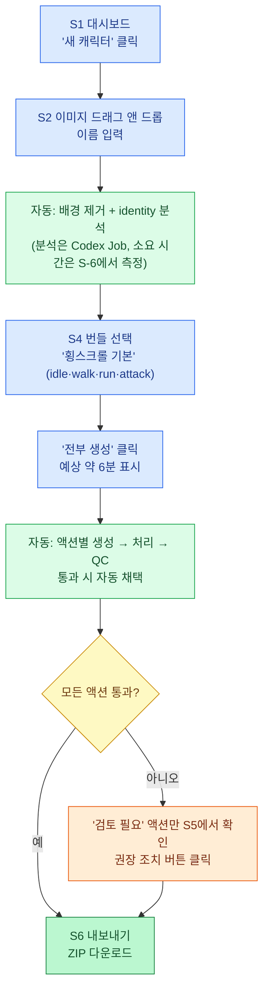
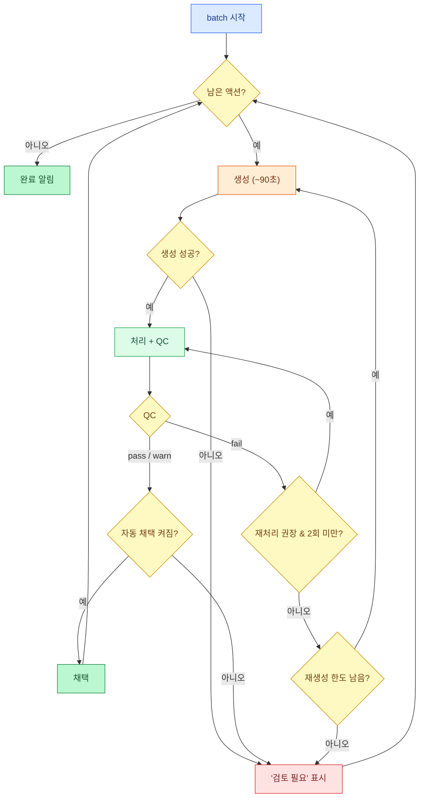

# 09. Web UI 설계

## 1. 목표

Web UI의 목적은 **이미지 생성을 쉽게 만드는 것**이다. 사용자가 CLI 명령, 프롬프트 문법, 파이프라인 파라미터를 몰라도 캐릭터 이미지 한 장으로 Phaser용 애니메이션까지 만들 수 있어야 한다.

### 1.1 설계 원칙

| 원칙 | 구체적 의미 |
|---|---|
| **기본값만으로 끝까지 간다** | 이미지 업로드 → "전부 생성" 한 번으로 export까지 가능. 모든 설정은 선택 사항 |
| **느린 작업은 기다리게 하지 않는다** | Codex 생성(약 90초)은 백그라운드 Job. 진행 단계·경과 시간·예상 시간을 계속 보여줌. 다른 화면으로 가도 계속 진행 |
| **빠른 작업은 즉시 반응한다** | 재처리(약 2초)는 파라미터를 바꾸면 바로 미리보기 갱신 |
| **아무것도 잃지 않는다** | 모든 생성 결과가 attempt로 남고 언제든 다른 attempt를 채택할 수 있음. 삭제 버튼 없음 |
| **QC는 말로 설명한다** | "QC-07 fail 0.81" 대신 "attack 캐릭터가 idle보다 19% 작습니다" + 해결 버튼 |
| **비용을 보여준다** | 재생성 버튼마다 "~90초", 일괄 생성 전 "4개 액션 · 약 6분" 표시 |

### 1.2 범위

- 로컬 단일 사용자(`http://127.0.0.1:8765`). 로그인 없음.
- 한국어 UI. 기술 용어(idle, walk, fps, anchor)는 원어 병기.
- 데스크톱 브라우저(최신 Chrome, Safari, Firefox). 모바일 레이아웃은 범위 밖.

---

## 2. 화면 구성

| ID | 화면 | 경로 | 목적 |
|---|---|---|---|
| S1 | 대시보드 | `/` | 캐릭터 목록, Codex 상태, 진행 중 Job |
| S2 | 새 캐릭터 | `/new` | reference 업로드 또는 텍스트로 생성 |
| S3 | 캐릭터 정보(Identity) | `/c/:id/identity` | 분석된 외형 속성 확인·수정 |
| S4 | 애니메이션 플랜 | `/c/:id/plan` | 액션 선택, 프레임·fps 등 설정 |
| S5 | 액션 스튜디오 | `/c/:id/studio/:action` (탑다운: `/c/:id/studio/:action/:direction`) | 생성·미리보기·QC·재처리·채택 (핵심 화면) |
| S6 | 내보내기 | `/c/:id/export` | atlas 미리보기, 다운로드, Phaser 코드 |
| S7 | 상태 | `/status` | Codex 진단, 사용량 |

전역 요소: 상단 바에 Codex 상태 배지(초록 "준비됨" / 빨강 "로그인 필요" 등)와 Job 트레이(진행 중 작업 수, 클릭 시 목록)를 항상 표시한다.

---

## 3. 핵심 사용자 흐름

### 3.1 가장 짧은 경로 (Case A: 이미지 있음)

사용자가 할 일은 "이미지 올리기 → 번들 고르기 → 전부 생성 → 다운로드" 네 번의 조작뿐이다. 나머지(배경 제거, identity 분석, plan 계산, 생성, 처리, QC, 통과 시 채택)는 자동으로 진행된다.



### 3.2 텍스트로 시작 (Case B)

S2에서 "설명으로 만들기"를 고르면 설명·스타일·view를 입력하고 후보 수(1–4)를 정한다. 후보는 순차 생성되고(후보당 약 90초) 도착하는 대로 카드로 나타난다. 하나를 선택하면 Case A의 "자동: 배경 제거 + identity 분석"부터 같은 흐름을 탄다.

```
설명 입력 → 후보 N장 순차 생성(카드가 하나씩 도착) → 1장 선택 → 배경 제거 + identity 분석 → S4 플랜
                       ↓ 마음에 안 듦
                 설명 수정 후 후보 추가 생성
```

### 3.3 한 액션을 세밀하게 다듬기

S5 스튜디오에서 한 액션을 반복 개선하는 루프다. 재처리는 즉시, 재생성은 Job으로 돈다.

```
생성 클릭 → (Job 진행 표시) → 결과 미리보기 + QC ─┬─ 만족 → 채택
                                                  ├─ 정렬·크기 문제 → 오른쪽 패널 슬라이더 조정 → 즉시 재처리
                                                  └─ 그림 자체 문제 → 권장 조치 버튼 또는 추가 지시 입력 → 재생성
```

---

## 4. 화면 명세

### S1. 대시보드

```text
┌──────────────────────────────────────────────────────────────────────────┐
│ sprite-animation-forge                    [● Codex 준비됨]  [⟳ Job 1개]   │
├──────────────────────────────────────────────────────────────────────────┤
│  캐릭터                                                   [+ 새 캐릭터]   │
│  ┌──────────────┐ ┌──────────────┐ ┌──────────────┐                        │
│  │  (idle 재생)  │ │  (idle 재생)  │ │   (썸네일)    │                        │
│  │ hero          │ │ slime        │ │ merchant     │                        │
│  │ ████████░ 3/4 │ │ ██████████ 5/5│ │ ░░░░░░░ 0/2  │                        │
│  │ ⚠ attack 검토 │ │ ✓ 내보내기 완료│ │ 플랜 필요     │                        │
│  └──────────────┘ └──────────────┘ └──────────────┘                        │
└──────────────────────────────────────────────────────────────────────────┘
```

- 카드: 채택된 idle 프레임을 작게 재생(없으면 reference 썸네일), 진행률(채택 액션 수 / plan 액션 수. 방향이 여러 개면 채택 unit 수 / 전체 unit 수), 다음 할 일 한 줄
- 카드 클릭 → 다음 할 일에 맞는 화면으로 이동(plan 없음 → S4, 검토 필요 → 해당 S5, 완료 → S6)
- 빈 상태: "캐릭터 이미지를 끌어다 놓거나, 설명으로 새 캐릭터를 만드세요" + 드롭 영역(S2로 바로 진입)
- Codex가 준비되지 않았으면 상단에 노란 배너: 원인과 해결 명령(`codex login`)을 복사 버튼과 함께 표시. 수동 업로드 경로는 계속 사용 가능

### S2. 새 캐릭터

두 개의 탭으로 구성한다.

**탭 A — 이미지로 시작**

- 드래그 앤 드롭, 파일 선택, 클립보드 붙여넣기(⌘V) 지원
- 이름(character_id) 자동 제안: 파일명에서 슬러그 생성, 중복 시 `-2` 접미사
- view 선택(side 기본, 이미지만 보고 추정하지 않음), 스타일(`project_native` 기본). view가 `topdown`이면 "올린 이미지가 향한 방향"(`facing`, 기본 앞면)도 고른다. 대표 방향 reference로 쓰이며 뒷면·옆면 이미지를 올려도 된다
- 이미지를 고르는 것(드롭·선택·붙여넣기) 자체가 "만들기"다 — 캐릭터 생성 → 업로드 → 배경 제거 결과를 전후 비교(체커보드 배경)로 즉시 표시 → identity 분석 Job 시작 → S4(플랜)로 이동한다(§3.1의 4번 조작 흐름). S3는 플랜 화면의 링크로 언제든 연다

**탭 B — 설명으로 시작**

- 설명(자유 텍스트, 한국어 가능), 스타일, view, 후보 수(1–4, 기본 2)
- "후보 생성 (약 3분)" → 후보 카드가 도착하는 대로 표시 → 카드 선택 → "이 캐릭터로 진행"

### S3. 캐릭터 정보(Identity)

```text
┌─────────────────────┬─────────────────────────────────────────────┐
│                     │ 실루엣     [small chibi knight with a tall…]│
│   (reference 이미지) │ 비율       [short and stocky    ] 머리 [1:2.5]│
│   체커보드 배경       │ 얼굴       [hidden by a steel visor…      ]│
│                     │ 의상       [red pointed hood, red scarf…   ]│
│  [원본] [배경 제거]   │ 무기       [sheathed sword, gold pommel…   ]│
│                     │ 주 색상    ■#C8281E ■#9A9CA0 [+]             │
│                     │ 보조 색상  ■#E8D2A8 ■#6B3F1F [+]             │
│                     │ 외곽선/음영 [dark brown] [soft cel shading]   │
│                     │                                             │
│                     │ ⓘ 배경 키 색: magenta (#FF00FF) — 충돌 없음    │
│                     │                  [다시 분석] [저장 후 다음 →] │
└─────────────────────┴─────────────────────────────────────────────┘
```

- 필드는 영어 짧은 구문(프롬프트에 그대로 들어가기 때문). 입력칸 아래에 "이 내용이 모든 생성 프롬프트에 들어갑니다" 안내
- 색상 칩 클릭 → reference 이미지 위 스포이트로 색 추출
- 키 색 충돌 표시: 팔레트 중 #FF00FF와 거리 120 미만인 색이 있으면 "이 색 때문에 배경 키를 green으로 바꿉니다" 경고([05](05-sprite-pipeline.md) §3.4)
- 분석 Job 실행 중에는 필드에 스켈레톤 표시. 실패해도 빈 폼으로 계속 진행 가능

### S4. 애니메이션 플랜

```text
┌───────────────────────────────────────────────────────────────────────┐
│ 번들:  (●) 횡스크롤 기본  ( ) 횡스크롤 액션  ( ) 탑다운 RPG  ( ) NPC  ( ) 직접 │
├───────────────────────────────────────────────────────────────────────┤
│ [✓] idle    4프레임  2x2  6fps  반복  feet  fit        [상태: 채택됨 ✓]  │
│ [✓] walk    6프레임  2x3  10fps 반복  feet  fit        [상태: 없음]      │
│ [✓] run     6프레임  2x3  12fps 반복  feet  fit        [상태: 없음]      │
│ [✓] attack  6프레임  2x3  12fps 1회   feet  preserve   [상태: 없음]      │
│ [ ] jump / fall / hurt / death / shoot / cast            [+ 사용자 정의] │
├───────────────────────────────────────────────────────────────────────┤
│ 출력 cell [128 x 128 ▾]   view [side ▾] 방향 [right]    ▸ 고급 설정       │
│ (topdown일 때) 방향: [✓앞] [✓뒤] [✓우] [✓좌: 우측면 반전 (●)]              │
│                                                                       │
│ 생성할 액션 3개 · 예상 약 4분 30초 (재생성 제외)                            │
│ [✓] QC 통과 시 자동 채택   재생성 한도 [1 ▾]         [▶ 전부 생성]          │
└───────────────────────────────────────────────────────────────────────┘
```

- 행을 펼치면 frames, fps, loop, anchor, scale_strategy, x_anchor를 편집. 기본값에서 바뀐 값은 굵게 표시하고 "기본값으로" 버튼 제공
- frames를 바꾸면 grid가 자동 계산되어 옆에 표시([02](02-skill-spec.md) §5.2)
- "사용자 정의" 액션: 이름, 모션 설명(영어 권장, 한국어 가능), 프레임 수, loop 입력
- "전부 생성": 채택되지 않은 액션만 plan 순서대로 일괄 Job에 넣는다. idle이 없고 scale profile도 없으면 idle을 먼저 넣는다는 안내 표시
- 예상 시간 = 생성 unit 수 × 최근 생성 소요 시간 중앙값(초기값 90초). 방향이 여러 개면 unit = 액션 × Codex 생성 방향(mirror 파생 `left` 제외). `topdown-rpg` 기본은 5 × 3 = 15개, 약 22분 30초
- **방향 선택**(view=`topdown`일 때만 표시): 앞(down)·뒤(up)·우(right)·좌(left) 체크박스. 좌측면 옆에 "우측면 반전" 스위치가 있고 기본 켜짐이다. 끄면 좌측면을 별도로 생성하므로 예상 시간이 늘어난다는 문구를 보여 준다. 캐릭터마다 좌우가 다를 수 있으므로(무기를 한 손에만 듦 등) 스위치 옆에 안내 툴팁을 두고, identity에서 좌우 비대칭 단서가 감지되면 "비대칭일 수 있습니다" 경고 배지를 표시한다([02](02-skill-spec.md) §8.1). 플랜 생성 후에도 이 스위치로 언제든 바꿀 수 있으며, 반전 → 별도 생성은 기존 반전 결과를 attempt 001로 보존하고 별도 생성 → 반전은 확인 대화상자를 거친다
- 액션 행을 펼치면 액션별 방향 override(예: death는 앞면만)를 체크박스로 편집한다
- 방향 선택은 plan의 `directions`·`mirror`·`actions.*.directions`에 저장된다([02](02-skill-spec.md) §8.1). 플랜 요약의 상태 열은 "방향 2/3 채택"처럼 unit 채택 수로 표시한다

### S5. 액션 스튜디오 (핵심 화면)

```text
┌────────────────────────────────────────────────────────────────────────────────┐
│ ◀ hero    [idle ✓] [walk ●생성중] [run ○] [attack ⚠]              [● Codex 준비됨] │
├──────────────────┬───────────────────────────────────────────┬─────────────────┤
│ 생성              │  ┌─────────────────────────────────────┐  │ 품질 검사        │
│                  │  │                                     │  │ ⚠ 검토 필요       │
│ 추가 지시 (선택)   │  │        ▶ 애니메이션 플레이어           │  │                 │
│ ┌──────────────┐ │  │   체커보드 · 기준선 · 중심선 · 어니언   │  │ ✓ 칸 경계        │
│ │칼을 더 크게 휘두│ │  │                                     │  │ ✓ 발 위치 일정    │
│ │르게           │ │  └─────────────────────────────────────┘  │ ⚠ 크기 변화 7%   │
│ └──────────────┘ │  ▶ ❚❚  12fps [────●──]  1x 2x 4x            │   (권장 5% 이하)  │
│ [프롬프트 보기]    │  [어니언] [idle 겹쳐보기] [기준선]            │ ✓ 빈 프레임 없음  │
│                  │                                           │ ✗ 캐릭터가 idle   │
│ [▶ 새로 생성 ~90s]│  [원본+격자] [배경 제거] [프레임]              │   보다 19% 작음   │
│                  │  ┌──┬──┬──┬──┬──┬──┐                       │                 │
│ ─ 진행 중 ───────  │  │00│01│02│03│04│05│  ← 프레임 스트립        │ 권장 조치         │
│ 이미지 생성 중     │  └──┴──┴──┴──┴──┴──┘                       │ [크기 유지로 재처리]│
│ 34초 / 약 90초    │                                           │   ~2초           │
│ ███████░░░░░░░    │  시도 기록                                  │ [몸 크기 유지 문구로│
│ [취소]            │  [001 ✗75] [002 ⚠92] [003 ●]               │   재생성] ~90초   │
│                  │                                           │                 │
│                  │                                           │ [✓ 이 시도 채택]  │
│                  │                                           │ ▸ 세부 조정        │
└──────────────────┴───────────────────────────────────────────┴─────────────────┘
```

**상단 액션 탭**: plan의 액션을 모두 표시. 상태 아이콘 ✓(채택) / ●(생성 중) / ⚠(검토 필요) / ○(없음). 탭을 옮겨도 진행 중 Job은 계속된다.

**방향 탭**(plan의 `directions`가 2개 이상일 때만): 액션 탭 바로 아래에 `[앞 ✓] [뒤 ●] [우 ○] [좌 ↔]`를 표시하고 각각 같은 상태 아이콘을 쓴다. 선택한 (액션, 방향) unit의 생성·결과·QC가 아래 세 패널에 나타난다. 경로는 `/c/:id/studio/:action/:direction`이다.

- `좌 ↔`는 mirror 파생 unit이다. 생성·재처리·채택 버튼이 없고 "우측면을 좌우반전한 결과입니다"와 "별도로 생성" 버튼(mirror 해제, plan 변경)만 보인다. 플레이어·프레임 스트립은 읽기 전용으로 동작한다
- 처음 여는 방향은 대표 방향이다. 대표 방향 idle이 채택되기 전에 다른 방향을 생성하려 하면 "먼저 앞면 idle을 채택하세요(스케일·외형 기준)" 안내를 표시하고 버튼을 비활성화한다
- "방향 비교 보기": 같은 액션의 네 방향 첫 프레임을 한 줄로 놓아 외형·크기 일관성을 확인한다(`ToggleGroup`으로 전환)

**왼쪽 — 생성 패널**

- 추가 지시: 자유 텍스트(최대 500자). 프롬프트의 `ADDITIONAL DIRECTION` 블록에 들어간다
- "프롬프트 보기": 최종 프롬프트를 읽기 전용 모달로 표시(블록별 색 구분). 직접 편집은 허용하지 않는다(결정성·재현성 유지). 복사 버튼 제공
- "새로 생성": Job 생성. 같은 캐릭터에서 이미 Codex Job이 돌고 있으면 "대기열 2번째" 표시
- 진행 표시: 단계([03](03-codex-image-provider.md) §7) + 경과/예상 시간 진행 막대 + 접을 수 있는 Codex 로그(agent 메시지)
- 실패 시: 에러 코드별 사용자 메시지와 해결 방법, "다시 시도" 버튼

**가운데 — 결과 영역**

- 애니메이션 플레이어(§5)
- 보기 탭
  - **원본+격자**: `raw.png` 위에 `process.json`의 행·열 경계(초록 실선 = gutter 스냅 성공, 빨강 점선 = gutter 없음), 프레임 bbox, anchor 점을 SVG로 겹쳐 그림
  - **배경 제거**: `clean.png`를 체커보드 위에 표시. 슬라이더로 원본과 좌우 비교
  - **프레임**: 출력 프레임 격자. 프레임 클릭 → 플레이어가 해당 프레임에서 정지
- 프레임 스트립: 정규화된 프레임 썸네일. QC 문제가 있는 프레임에 빨간 테두리(예: 경계 침범 칸)
- 시도 기록: attempt 썸네일 + QC 점수. 클릭 시 해당 attempt 로드. 채택된 attempt에 ✓ 배지. 추가 지시·복구 코드는 툴팁으로 표시

**오른쪽 — QC 패널**

- 요약 배지: 통과 / 검토 필요(warn) / 실패(fail)
- 항목별 한 줄 설명. QC ID는 작은 글씨로 병기. 수치는 사람이 읽는 형태("7%", "19% 작음", "2px")
- 권장 조치 버튼: `qc-report.json`의 `recommendations` 순서대로. 재처리는 즉시 실행, 재생성은 Job 생성. 각 버튼에 예상 시간
- "이 시도 채택": fail이 있으면 확인 대화상자("품질 검사 실패 항목이 있습니다. 그래도 채택할까요?")
- 세부 조정(접힘): §6 재처리 패널

**키보드 단축키**: `Space` 재생/정지, `←/→` 프레임 이동, `O` 어니언, `G` 새로 생성, `A` 채택.

### S6. 내보내기

- atlas 미리보기(행마다 액션 이름 표시), 크기와 파일 용량
- 액션별 QC 요약 표. 강제 채택된 액션 강조
- 엔진 선택: Phaser(기본) / Generic
- 버튼: "내보내기 실행"(export 명령), "ZIP 다운로드"(atlas + animations.json + meta + preview), 파일별 개별 다운로드
- Phaser 코드 스니펫([07](07-export.md) §7)을 캐릭터 id·origin 값을 채워 표시하고 복사 버튼 제공
- 누락 액션이 있으면 경고와 함께 해당 S5로 가는 링크

### S7. 상태

- Codex 진단 결과([03](03-codex-image-provider.md) §11)를 항목별 ✓/✗로 표시. 실패 항목마다 해결 명령과 복사 버튼
- "다시 확인" 버튼(캐시 무시)
- 사용량: 캐릭터별·전체 Codex 호출 수, 입력/출력 토큰 누계, 평균 생성 시간
- 검증 버전과 현재 버전이 다르면 "계약 테스트를 실행하세요" 안내

---

## 5. 애니메이션 플레이어

PNG 프레임을 `<canvas>`로 재생한다. GIF를 쓰지 않는 이유는 반투명 가장자리와 정확한 fps를 유지하기 위해서다.

| 기능 | 명세 |
|---|---|
| 재생 | `requestAnimationFrame` + 누적 시간 기반 프레임 전환. plan의 fps 기본, 슬라이더로 1–30 조정(저장 안 함) |
| 반복 | loop 액션은 반복, one-shot은 마지막 프레임에서 400ms 정지 후 반복(미리보기용) |
| 배율 | 1x / 2x / 4x / 창 맞춤. 픽셀 스타일은 `imageSmoothingEnabled = false` |
| 배경 | 체커보드(기본) / 단색 흰색 / 단색 검정 / 게임 배경색 직접 지정 |
| 기준선 | `baseline_y`에 가로선, `CW/2`에 세로선 |
| 어니언 스킨 | 이전 1프레임을 30% 불투명도로 겹침 |
| idle 겹쳐 보기 | 채택된 idle 첫 프레임을 같은 배율로 40% 불투명도 겹침. 액션 간 크기 차이 확인용([06](06-qc-and-recovery.md) §2.2) |
| 캐시 무효화 | 이미지 URL에 파일 sha256을 쿼리로 붙임(`?v=<hash>`). 재처리 후 즉시 새 프레임 반영 |

---

## 6. 재처리 패널

재처리는 `raw.png`를 다시 생성하지 않고 후처리 파라미터만 바꿔 다시 계산한다. 값을 바꾸면 300ms 디바운스 후 자동 실행하고, 미리보기와 QC가 갱신된다. 실행 중에는 이전 결과를 흐리게 유지한다(깜빡임 방지).

| 컨트롤 | 파라미터 | 범위 |
|---|---|---|
| 배경 허용치 | `t_in` / `t_out` | 0–120 / 30–200 (`t_in < t_out` 강제) |
| 가장자리 정리 | `despill`, `edge_band_px` | on/off, 0–4 |
| 기준점 | `anchor` | feet / bottom / center |
| 가로 기준 | `x_anchor` | mass / feet / bbox |
| 크기 전략 | `scale_strategy` | fit / preserve |
| 조각 처리 | `components` | largest / all |
| 조각 병합 거리 | `merge_gap_px` | 0–64 |
| 여백 | `margin.top/side/bottom` | 0–32 |

"기본값으로" 버튼, 현재 값이 plan 기본값과 다른 항목 강조. 재처리 결과가 만족스러우면 "이 설정을 plan에 저장"으로 해당 액션의 기본값을 바꿀 수 있다(이후 재생성에도 적용).

---

## 7. 일괄 생성 동작

S4 "전부 생성"은 하나의 batch Job을 만들고, 그 안에서 액션을 순서대로 처리한다.

1. 액션마다: 생성 → 처리 → QC
2. `pass` 또는 `warn` + "자동 채택" 켜짐 → 채택
3. `fail` → 권장 조치 중 재처리를 최대 2회 자동 적용 → 여전히 `fail`이면 재생성(한도 `max_regenerations`, 기본 1)
4. 그래도 `fail` → 해당 액션을 "검토 필요"로 두고 다음 액션으로
5. 모두 끝나면 알림(브라우저 Notification 권한이 있으면 시스템 알림, 없으면 페이지 토스트)

일괄 Job은 대시보드와 Job 트레이에서 "hero: 2/4 · walk 생성 중"처럼 보인다. 취소하면 진행 중인 Codex 호출을 중단하고, 이미 끝난 액션 결과는 유지한다.



---

## 8. 오류·예외 UX

| 상황 | 표시 | 사용자 조치 |
|---|---|---|
| Codex 미설치 / 미로그인 / 기능 꺼짐 | 상단 배너 + 생성 버튼 비활성 + 툴팁 | 명령 복사 → 터미널 실행 → "다시 확인" |
| 생성 실패(`codex_failed`, `image_gen_failed`) | 생성 패널에 빨간 카드: 요약 + "자세히"(stderr 마지막 20줄) | 다시 시도 / 추가 지시 수정 |
| 시간 초과 | "생성 시간이 5분을 넘었습니다" | 다시 시도 |
| 서버 재시작으로 중단 | attempt에 "중단됨" 배지 | 다시 생성 |
| 서버 연결 끊김 | 상단에 "서버에 연결할 수 없음" + 자동 재연결(지수 백오프, 최대 30초) | — |
| Codex를 쓸 수 없을 때 | S5에 "직접 업로드" 버튼 항상 노출 | 다른 도구로 만든 raw sheet 업로드 → 같은 처리·QC |

---

## 9. 프론트엔드 구조

### 9.1 기술

React + Vite + TypeScript, TanStack Query(서버 상태), React Router(라우팅), Tailwind CSS, **shadcn/ui**(UI 컴포넌트). 전역 상태 라이브러리는 쓰지 않는다. 서버 상태는 TanStack Query 캐시, 화면 상태는 컴포넌트 로컬 상태로 충분하다.

**UI 컴포넌트 규칙**

- 버튼·입력·탭·다이얼로그 같은 범용 UI 요소는 직접 만들지 않고 shadcn/ui를 쓴다. 필요한 컴포넌트는 그때그때 `shadcn add`로 설치한다(§9.5).
- shadcn/ui는 npm 의존성이 아니라 소스를 복사해 오는 방식이다. 설치된 파일은 `src/components/ui/`에 들어가고 저장소에 커밋한다. 스타일 조정이 필요하면 이 파일을 고치지 말고 사용하는 쪽에서 `className`으로 덮는다(재설치·업데이트 시 diff를 작게 유지).
- shadcn/ui에 없는 도메인 컴포넌트(AnimationPlayer, GridOverlay, CompareSlider, DropZone, PaletteEditor)만 `src/components/`에 직접 작성하고, 내부의 버튼·슬라이더·툴팁은 shadcn 컴포넌트를 조합한다.
- 아이콘은 shadcn 기본 아이콘 라이브러리(`lucide-react`)를 쓴다.

### 9.2 디렉터리

```text
webui/web/src/
├── main.tsx
├── routes.tsx
├── api/
│   ├── client.ts            # fetch 래퍼, 에러 정규화
│   ├── types.ts             # API 응답 타입 (10 문서와 1:1)
│   ├── queries.ts           # useCharacter, usePlan, useAttempts, useHealth …
│   └── sse.ts               # useJobEvents(jobId) — EventSource + 재연결
├── pages/
│   ├── Dashboard.tsx
│   ├── NewCharacter.tsx
│   ├── Identity.tsx
│   ├── Plan.tsx
│   ├── Studio.tsx
│   ├── Export.tsx
│   └── Status.tsx
├── lib/
│   └── utils.ts             # shadcn `cn()` 헬퍼 (shadcn init이 생성)
└── components/
    ├── ui/                  # shadcn/ui 설치 결과 (§9.5). 직접 수정하지 않음
    ├── AnimationPlayer.tsx
    ├── GridOverlay.tsx      # raw 위 경계·bbox·anchor SVG
    ├── CompareSlider.tsx    # 원본/배경제거 비교
    ├── QcPanel.tsx
    ├── RecommendationButtons.tsx
    ├── ReprocessPanel.tsx
    ├── AttemptStrip.tsx
    ├── JobProgress.tsx
    ├── JobTray.tsx
    ├── CodexStatusBadge.tsx
    ├── PaletteEditor.tsx
    └── DropZone.tsx
```

### 9.3 데이터 갱신 규칙

| 이벤트 | 갱신 |
|---|---|
| Job SSE `state=succeeded` | 해당 캐릭터의 attempts·manifest 쿼리 무효화 |
| 재처리 응답 | 응답 본문(qc, 파일 해시)으로 캐시 직접 갱신 |
| 채택 응답 | character·plan 상태 쿼리 무효화 |
| `/api/health` | 60초 간격 폴링 + 창 포커스 시 |

### 9.4 shadcn/ui 초기 설정

`webui/web`에서 한 번만 실행한다.

```bash
pnpm dlx shadcn@latest init
```

- `components.json`의 `aliases`는 `@/components`, `@/components/ui`, `@/lib/utils`로 둔다. 이를 위해 `vite.config.ts`(`resolve.alias`)와 `tsconfig`(`paths`)에 `@` → `src` 별칭을 추가한다.
- `init`이 Tailwind CSS 변수(테마 토큰)와 `lib/utils.ts`를 만든다. 테마 색은 이 CSS 변수로만 바꾼다.
- `components.json`과 `src/components/ui/`는 커밋 대상이다.

### 9.5 사용할 shadcn/ui 컴포넌트

화면 명세(§4)에서 필요한 요소를 shadcn 컴포넌트에 대응시킨 표다. M5 해당 화면을 구현할 때 아래 컴포넌트를 설치한다. 표에 없는 컴포넌트가 필요해지면 `shadcn add`로 추가하고 이 표도 갱신한다.

| 컴포넌트 | 용도 | 사용 화면 |
|---|---|---|
| `button` | 모든 버튼(생성, 채택, 권장 조치, 복사) | 전체 |
| `card` | 캐릭터 카드, 상태 카드, 오류 카드 | S1, S5, S7 |
| `badge` | Codex 상태 배지, QC 요약(통과/검토 필요/실패), 시도 ✓ 배지, 중단됨 | 전체 |
| `tabs` | S2 탭 A/B, S5 상단 액션 탭, 보기 탭(원본+격자/배경 제거/프레임) | S2, S5 |
| `input` / `textarea` / `label` | 이름, 설명, 추가 지시(500자), Identity 필드 | S2, S3, S4, S5 |
| `select` | view, 스타일, 출력 cell, 엔진, 재생성 한도 | S2, S4, S6 |
| `radio-group` | 번들 선택 | S4 |
| `checkbox` / `switch` | 액션 선택, 자동 채택, 가장자리 정리 on/off | S4, S5 |
| `table` | 액션 plan 행, QC 요약 표 | S4, S6 |
| `collapsible` | 액션 행 펼치기, 고급 설정, 세부 조정, Codex 로그 | S4, S5 |
| `slider` | 재처리 파라미터, fps, 프레임 이동 | S5 |
| `toggle-group` | 배율(1x/2x/4x), 배경 선택, 플레이어 오버레이 토글 | S5 |
| `progress` | 진행률 막대(캐릭터 카드, Job 진행, 배치) | S1, S5 |
| `dialog` | 프롬프트 보기(읽기 전용 모달) | S5 |
| `alert-dialog` | fail 채택 확인("그래도 채택할까요?") | S5 |
| `alert` | Codex 미준비 배너, 키 색 충돌 경고, 누락 액션 경고 | S1, S3, S6 |
| `popover` | Job 트레이 | 전역 |
| `tooltip` | QC ID, 복구 코드, 비활성 버튼 사유 | 전체 |
| `skeleton` | Identity 분석 중 필드 | S3 |
| `scroll-area` | Job 트레이 목록, 시도 기록, 프레임 스트립 | S5, 전역 |
| `separator` | 패널 구분 | S5 |
| `sonner` | 일괄 생성 완료 토스트(Notification 권한 없을 때) | 전역 |

한 번에 설치하는 명령:

```bash
pnpm dlx shadcn@latest add button card badge tabs input textarea label select \
  radio-group checkbox switch table collapsible slider toggle-group progress \
  dialog alert-dialog alert popover tooltip skeleton scroll-area separator sonner
```

단축키(§4 S5)는 shadcn 컴포넌트가 아니라 페이지 레벨 `keydown` 핸들러로 구현한다. 입력창(`textarea`, `input`)에 포커스가 있을 때는 단축키를 무시한다.

### 9.6 개발·배포

- 개발: `pnpm dev`(Vite, 5173) → `/api`, `/files`를 FastAPI(8765)로 프록시
- 배포: `pnpm build` 결과(`webui/web/dist`)를 FastAPI가 정적 파일로 서빙. 사용자는 `uv run sprite-forge-web` 하나로 실행하고 `http://127.0.0.1:8765`를 연다
