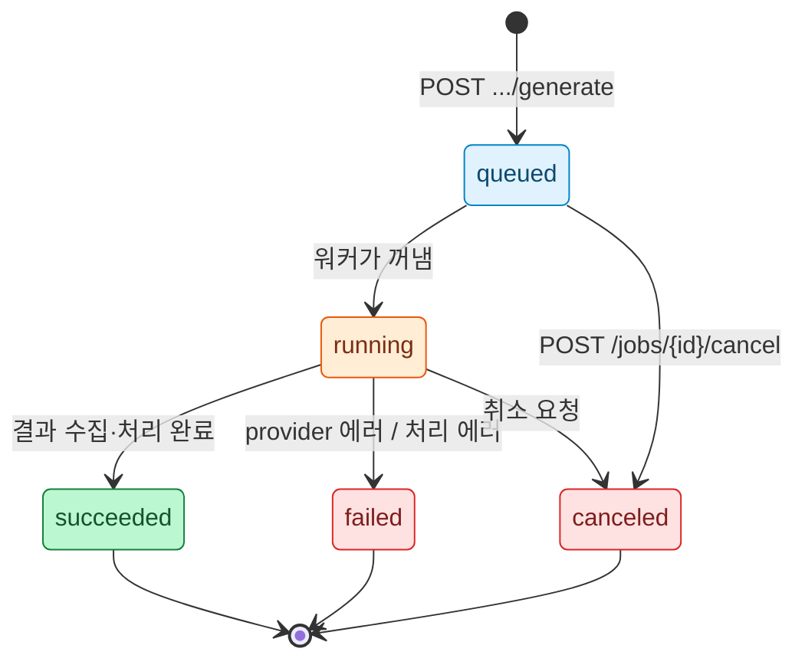

# 10. Backend API (FastAPI · Job 큐 · SSE)

## 1. 개요

Web UI 서버(`sprite_forge_web`)는 Core 패키지 `sprite_forge`를 직접 import하는 얇은 FastAPI 앱이다. 서버 고유의 로직은 **Job 큐와 이벤트 스트림뿐**이고, 나머지 엔드포인트는 Core 함수를 HTTP로 노출한다. 상태는 파일 시스템에 있으므로([08](08-data-model.md)) 서버는 재시작해도 잃는 것이 진행 중이던 Job뿐이다.

| 항목 | 값 |
|---|---|
| 실행 | `uv run sprite-forge-web` |
| 바인딩 | `127.0.0.1:8765` (변경 가능: 포트만) |
| 경로 | `/api/*` JSON API, `/files/*` 캐릭터 디렉터리 정적 파일, `/*` SPA |

환경 변수:

| 변수 | 기본값 | 설명 |
|---|---|---|
| `SPRITE_FORGE_ROOT` | `./sprites` | 캐릭터 루트 |
| `SPRITE_FORGE_PORT` | `8765` | 포트 |
| `SPRITE_FORGE_CODEX_BIN` | `codex` | Codex 실행 파일 경로 |
| `SPRITE_FORGE_CODEX_TIMEOUT` | `300` | 1회 생성 타임아웃(초) |
| `CODEX_HOME` | (Codex 기본) | Codex가 쓰는 값을 그대로 따름 |

---

## 2. Job 모델

### 2.1 Job 종류

Codex를 호출하는 작업만 Job이 된다. 나머지(업로드, 재처리, 채택, 내보내기)는 수 초 안에 끝나므로 동기 요청으로 처리한다.

| type | 내용 | 대략 소요 |
|---|---|---|
| `reference_generate` | Case B 후보 N장 생성 | N × 90초 |
| `identity_analyze` | reference 외형 분석 | S-6에서 측정 |
| `action_generate` | 액션 1회 생성 + 자동 처리 + QC | 90초 + 2초 |
| `batch_generate` | 여러 액션 일괄 생성([09](09-web-ui.md) §7) | 액션 수 × 90초 이상 |

### 2.2 큐

- Codex 호출 Job은 **전역 단일 워커**가 FIFO로 처리한다(ADR-009).
- `batch_generate`는 실행되는 동안 워커를 점유한다. 그 사이 요청된 단건 생성은 뒤에서 기다린다(`queue_position` 표시).
- 워커는 동기 Core 함수(`CodexCliProvider.generate`, `pipeline.process`)를 `asyncio.to_thread`로 실행하고, 진행 콜백을 이벤트 버스로 전달한다.
- 취소: `queued`면 큐에서 제거, `running`이면 `provider.cancel()`(SIGTERM → 5초 후 SIGKILL).

### 2.3 상태 전이

Job은 대기 → 실행 → 종료 세 단계를 거친다. 실행 중에는 `stage`가 세부 진행을 나타낸다. 서버가 재시작되면 메모리의 Job은 사라지고, 실행 중이던 attempt는 기동 시 `interrupted`로 표시된다(§6).



`running` 안의 `stage`는 다음 순서로 진행한다(`action_generate` 기준, 앞의 네 단계는 [03](03-codex-image-provider.md) §7).

```
starting → session → generating → collecting → processing → qc
```

### 2.4 Job 객체

```json
{
  "id": "job_3f9a1c2b7d10",
  "type": "action_generate",
  "character": "hero",
  "action": "walk",
  "attempt": "003",
  "state": "running",
  "stage": "generating",
  "queue_position": 0,
  "created_at": "2026-09-30T13:17:50Z",
  "started_at": "2026-09-30T13:17:54Z",
  "finished_at": null,
  "elapsed_s": 34,
  "expected_s": 90,
  "progress": null,
  "log": [
    { "t": "2026-09-30T13:18:01Z", "level": "info", "text": "I'm using the image-generation skill…" }
  ],
  "result": null,
  "error": null
}
```

- `progress`: batch일 때 `{ "done": 1, "total": 4, "current": "walk" }`
- `log`: 최근 50줄(Codex agent 메시지, 경고)
- `result`: 성공 시 `{ "attempt": "003", "qc_status": "warn", "accepted": false }`
- `error`: 실패 시 `{ "code": "codex_failed", "message": "…", "detail": { "stderr_tail": "…" } }`

---

## 3. 이벤트 스트림 (SSE)

탭마다 EventSource 하나로 **모든 Job 이벤트**를 받는다. 화면은 필요한 Job만 걸러 쓴다. Job마다 연결을 여는 것보다 단순하다.

```text
GET /api/events
Content-Type: text/event-stream

event: job
data: {"id":"job_3f9a1c2b7d10","state":"running","stage":"generating","elapsed_s":34,"expected_s":90,"message":"이미지 생성 중"}

event: job
data: {"id":"job_3f9a1c2b7d10","state":"succeeded","stage":"qc","result":{"attempt":"003","qc_status":"warn","accepted":false}}

: ping
```

- 상태·단계가 바뀔 때, 로그가 추가될 때, 그리고 실행 중에는 5초마다 `elapsed_s` 갱신 이벤트를 보낸다.
- 15초마다 `: ping` 주석으로 연결을 유지한다.
- 재연결 시 이벤트를 재전송하지 않는다. 클라이언트는 재연결 직후 `GET /api/jobs?active=1`로 현재 상태를 다시 받는다.

---

## 4. 오류 형식

도메인 오류는 아래 형식으로 응답한다. 요청 본문 스키마 오류는 FastAPI 기본 422를 그대로 쓴다.

```json
{ "error": { "code": "precondition_failed", "message": "reference 이미지가 없습니다", "detail": { "missing": "reference" } } }
```

| HTTP | code 예 | 상황 |
|---:|---|---|
| 400 | `invalid_image`, `invalid_param` | 업로드 이미지 디코드 실패, 파라미터 범위 초과 |
| 404 | `not_found` | 캐릭터·액션·attempt·Job 없음 |
| 403 | `forbidden_host` | `Host` 헤더가 `127.0.0.1:<port>`·`localhost:<port>`가 아님(§7) |
| 409 | `already_exists`, `busy`, `qc_failed` | 같은 id 존재, attempt 잠금 중, fail인데 `force` 없이 채택 |
| 412 | `precondition_failed` | reference·plan·scale profile 없음 |
| 503 | `codex_unavailable` | 생성 요청 시 doctor가 준비 안 됨(미설치·미로그인·기능 꺼짐). `detail`에 doctor 결과 |

---

## 5. 엔드포인트

### 5.1 목록

| 메서드 | 경로 | 동기/Job | 설명 |
|---|---|---|---|
| GET | `/api/health` | 동기 | doctor 결과(60초 캐시, `?refresh=1`로 무시) |
| GET | `/api/presets` | 동기 | 프레임 프리셋, 번들, 액션 기본값(폼 구성용) |
| GET | `/api/characters` | 동기 | 캐릭터 카드 목록 |
| POST | `/api/characters` | 동기 | 캐릭터 생성 |
| GET | `/api/characters/{cid}` | 동기 | manifest + 액션별 상태 요약 |
| POST | `/api/characters/{cid}/reference` | 동기 | reference 업로드(multipart) + 배경 제거 |
| POST | `/api/characters/{cid}/reference/generate` | Job | Case B 후보 생성 |
| POST | `/api/characters/{cid}/reference/attempts/{aid}/select` | 동기 | 후보 선택 |
| POST | `/api/characters/{cid}/identity/analyze` | Job | identity 분석 |
| GET · PUT | `/api/characters/{cid}/identity` | 동기 | profile 조회·저장(스키마 검증) |
| GET · PUT | `/api/characters/{cid}/plan` | 동기 | plan 조회·저장(grid·키 색 재계산) |
| POST | `/api/characters/{cid}/plan` | 동기 | actions/bundle/`--set` 값으로 plan 최초 생성(CLI `plan`과 같은 함수) |
| POST | `/api/characters/{cid}/actions/{action}/prompt` | 동기 | 프롬프트 미리보기 |
| POST | `/api/characters/{cid}/actions/{action}/generate` | Job | 새 attempt 생성 |
| POST | `/api/characters/{cid}/actions/{action}/upload` | 동기 | 수동 raw 업로드 → attempt + 자동 처리 |
| GET | `/api/characters/{cid}/actions/{action}/attempts` | 동기 | attempt 목록 |
| GET | `/api/characters/{cid}/actions/{action}/attempts/{aid}` | 동기 | attempt 상세(generation, process, qc, 파일 URL) |
| POST | `/api/characters/{cid}/actions/{action}/attempts/{aid}/process` | 동기 | 재처리 |
| POST | `/api/characters/{cid}/actions/{action}/attempts/{aid}/accept` | 동기 | 채택 |
| POST | `/api/characters/{cid}/actions/{action}/save-params` | 동기 | 재처리 파라미터를 plan 기본값으로 저장 |
| POST | `/api/characters/{cid}/generate-all` | Job | 일괄 생성 |
| POST | `/api/characters/{cid}/export` | 동기 | 내보내기 실행 |
| GET | `/api/characters/{cid}/export.zip` | 동기 | ZIP 다운로드 |
| GET | `/api/jobs` | 동기 | Job 목록(`?active=1`) |
| GET | `/api/jobs/{jid}` | 동기 | Job 상세 |
| POST | `/api/jobs/{jid}/cancel` | 동기 | 취소 |
| GET | `/api/events` | SSE | 전체 Job 이벤트 |
| GET | `/files/{cid}/{path}` | 동기 | 캐릭터 디렉터리 파일 |

### 5.2 주요 요청·응답

**캐릭터 생성**

```http
POST /api/characters
{ "id": "hero", "view": "side", "art_style": "project_native", "asset_type": "player" }

201
{ "character": { "id": "hero", "created_at": "2026-09-30T13:10:00Z", "next_step": "reference" } }
```

**액션 생성**

```http
POST /api/characters/hero/actions/attack/generate
{ "extra": "칼을 더 크게 휘두르게", "recovery": ["character_small"] }

202
{ "job": { "id": "job_…", "state": "queued", "queue_position": 1, "expected_s": 90 }, "attempt": "003" }
```

attempt 번호는 요청 시점에 할당하고 `prompt.txt`를 바로 쓴다. 따라서 대기 중인 Job도 "프롬프트 보기"가 가능하다.

**재처리**

```http
POST /api/characters/hero/actions/attack/attempts/003/process
{ "set": { "scale_strategy": "preserve", "t_in": 34 } }

200
{
  "attempt": "003",
  "qc": { "status": "pass", "score": 100, "results": [ … ], "recommendations": [] },
  "files": {
    "clean": "/files/hero/attack/attempts/003/clean.png?v=9c1e…",
    "sheet": "/files/hero/attack/attempts/003/sheet.png?v=51aa…",
    "frames": ["/files/hero/attack/attempts/003/frames/000.png?v=…"]
  },
  "derived": { "row_boundaries": [0, 615, 1254], "col_boundaries": [[0, 417, 822, 1254], [0, 419, 820, 1254]], "frames": [ … ] }
}
```

- `set`에 없는 파라미터는 plan의 액션 기본값을 쓴다.
- `derived`는 `process.json`의 같은 필드이며 GridOverlay가 그대로 사용한다.
- 같은 attempt에 재처리 요청이 겹치면 늦게 온 요청이 `409 busy`. 클라이언트는 디바운스로 겹침을 줄이고, 409면 300ms 뒤 한 번 재시도한다.

**채택**

```http
POST /api/characters/hero/actions/attack/attempts/003/accept
{ "force": false }

200
{ "accepted": "003", "scale_profile_updated": false, "requalified_actions": [] }
```

- idle(또는 첫 body 액션)을 채택하면 `scale_profile_updated: true`, 그리고 QC-07을 다시 계산한 액션 목록이 `requalified_actions`에 온다.

**일괄 생성**

```http
POST /api/characters/hero/generate-all
{ "actions": ["idle", "walk", "run", "attack"], "auto_accept": true, "max_regenerations": 1 }

202
{ "job": { "id": "job_…", "type": "batch_generate", "state": "queued", "progress": { "done": 0, "total": 4 }, "expected_s": 360 } }
```

`actions`를 생략하면 plan에서 아직 채택되지 않은 액션 전부.

---

## 6. 기동 시 복구

서버 시작 시 루트 아래 모든 `manifest.json`을 훑어 `generation_status == "running"`인 attempt를 `interrupted`로 바꾼다. 남은 `.lock` 파일은 해당 프로세스가 살아 있지 않으면(잠금 파일에 PID 기록) 제거한다.

```
서버 시작 → manifest 스캔 → running attempt → interrupted 표시 → 고아 .lock 정리 → 요청 수신 시작
```

---

## 7. 파일 서빙 보안

`/files/{cid}/{path}`는 사용자 로컬 파일을 노출하는 유일한 경로다.

| 규칙 | 구현 |
|---|---|
| 경로 정규화 | `(root / cid / path).resolve()`가 `root.resolve()` 하위인지 확인. 아니면 404 |
| 심볼릭 링크 | resolve 후 검사하므로 링크로 루트 밖을 가리키면 차단 |
| 확장자 | `.png .gif .json .txt .jsonl`만 허용 |
| 캐시 | `?v=` 쿼리가 있으면 `Cache-Control: public, max-age=31536000, immutable`, 없으면 `no-cache` |
| Origin | 서버가 `127.0.0.1`에만 바인딩. 추가로 `Host` 헤더가 `127.0.0.1:<port>` 또는 `localhost:<port>`가 아니면 거부(DNS rebinding 방지) |

---

## 8. 구현 메모

- 라우트 핸들러는 Core 함수 호출 + 예외 → 오류 형식 변환만 한다. 비즈니스 규칙을 서버에 두지 않는다(Skill 모드와 동작이 갈라지지 않도록).
- Core 예외는 `sprite_forge.errors.ForgeError(code, message, detail, http_status)` 하나로 통일하고 서버의 예외 핸들러가 변환한다.
- API 응답 타입은 Pydantic 모델로 정의하고, 빌드 시 OpenAPI 스키마에서 `webui/web/src/api/types.ts`를 생성한다(`openapi-typescript`). 수동으로 타입을 맞추지 않는다.
