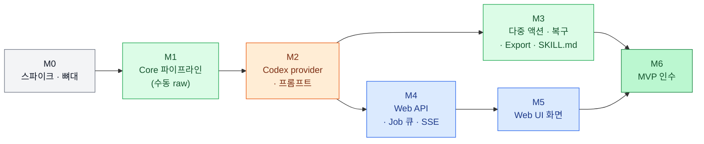

# 12. 로드맵 · 작업 분해 · 리스크

## 1. 마일스톤 개요

MVP는 7개 마일스톤(M0–M6)으로 나눈다. Core 파이프라인(M1)이 먼저 있어야 나머지가 의미를 가지며, Web UI 백엔드(M4)는 provider 인터페이스(M2 초반)가 정해지면 Core 후반 작업(M3)과 병행할 수 있다. 각 마일스톤은 "검증" 항목이 전부 통과해야 끝난다.

아래 그림은 의존 관계다. 같은 열의 작업은 병행 가능하다.

규모는 상대값(S < M < L)으로만 표시한다. 절대 일정은 M0 스파이크 후 다시 추정한다.

---

## 2. 마일스톤 상세

### M0. 스파이크와 저장소 뼈대 — S

Codex 동작의 남은 불확실성을 먼저 없앤다. 스파이크 결과에 따라 03 문서의 호출 규약이 바뀔 수 있기 때문이다.

1. 스파이크 S-1 ~ S-9 실행([03](03-codex-image-provider.md) §14) → 검증: 결과가 03 §2 표에 행으로 추가됨
2. `pyproject.toml`(uv 워크스페이스), `sprite-animation-forge/` 디렉터리, `webui/` 디렉터리 생성 → 검증: `uv run pytest`가 0개 테스트로 성공, `pnpm --dir webui/web dev`가 빈 페이지를 띄움
3. [03](03-codex-image-provider.md) §2·§6·§7의 이벤트·파일 형식으로 가짜 codex 작성 → 검증: 가짜 codex가 `success` 모드에서 `generated_images/<thread_id>/`에 PNG를 씀

### M1. Core 파이프라인 (수동 raw) — L

Codex 없이 `import-raw`로 넣은 이미지를 처리한다. 가장 큰 작업이며 품질의 대부분이 여기서 결정된다.

1. `chroma`, `split`, `components`, `measure`, `scale`, `align`, `process` 구현([05](05-sprite-pipeline.md)) → 검증: 합성 시트 변형 14종 단위 테스트 통과
2. `qc`(QC-01~07, 09) 구현([06](06-qc-and-recovery.md)) → 검증: 항목별 경계값 테스트, 적용 매트릭스 테스트 통과
3. `manifest`, `fsutil`(attempt 번호, 잠금, 원자적 쓰기) → 검증: 동시 쓰기 테스트 통과
4. `forge.py init / reference import / plan / import-raw / process / accept / status` → 검증: CLI 테스트(stdout JSON, 종료 코드)
5. golden(로컬 샘플)·결정성 테스트 → 검증: [11](11-testing.md) §3.2 속성 기준 통과, 두 번 처리한 해시 동일

**M1 완료 = PRD 시나리오 1·2를 수동 raw로 통과**

### M2. Codex provider와 프롬프트 — M

1. `providers/codex_cli.py`([03](03-codex-image-provider.md) §15) → 검증: 가짜 codex 모드 9종 테스트 통과
2. `prompt.py` + 템플릿 → 검증: [04](04-prompt-rules.md) §8 규칙 테스트, 스냅샷 테스트
3. `identity.py`(`--output-schema`), `reference generate/select` → 검증: 가짜 codex로 profile 생성, live 1회 스키마 통과
4. `forge.py doctor / generate / prompt` → 검증: live 계약 테스트 통과

**M2 완료 = 시나리오 1을 실제 Codex로 처음부터 끝까지 통과**

### M3. 다중 액션·복구·Export·Skill — L

1. Character Scale Profile, QC-07, preserve 배율 → 검증: `wide_attack` 대조 테스트(시나리오 4)
2. `recovery.py` 권장 조치 → 검증: 시나리오 5 합성 입력 3종의 1순위 조치 일치
3. `export/atlas.py`, `phaser.py`, `gif.py`, 검증 로직 → 검증: Phaser 스모크 통과, `anchor` 필드 동작 여부 확인 후 07 문서 갱신
4. `SKILL.md`, `references/*.md` 작성([02](02-skill-spec.md) §10–11) → 검증: Claude Code에서 "이 캐릭터로 idle, walk, run, attack 만들어줘"를 실행해 질문 없이 export까지 완료

**M3 완료 = 시나리오 3·4·5 통과 (가짜 codex), Skill 모드 end-to-end 1회 성공 (live)**

### M4. Web API — M

1. FastAPI 앱, 오류 형식, 파일 서빙 보안([10](10-backend-api.md) §4, §7) → 검증: 경로 탈출·Host 헤더 테스트
2. Job 큐(단일 워커), 취소, 기동 시 복구 → 검증: 큐 순서·취소·`interrupted` 테스트
3. SSE `/api/events` → 검증: 이벤트 순서 테스트
4. 엔드포인트 전체 → 검증: 정상·오류 경로 API 테스트
5. OpenAPI → `types.ts` 생성 → 검증: 프론트엔드 타입 체크 통과

### M5. Web UI 화면 — L

1. 공통: 라우팅, API 클라이언트, SSE 훅, Codex 상태 배지, Job 트레이
2. S1 대시보드, S2 새 캐릭터, S3 Identity, S4 플랜
3. S5 스튜디오: 애니메이션 플레이어, GridOverlay, QC 패널, 권장 조치, 재처리 패널, attempt 기록
4. S6 내보내기, S7 상태
5. 일괄 생성 흐름([09](09-web-ui.md) §7)

검증:

- Playwright 스모크(가짜 codex): 이미지 업로드 → 번들 선택 → 전부 생성 → ZIP 다운로드가 **조작 4번**으로 끝남
- 재처리 슬라이더 변경 후 2초 안에 미리보기 갱신
- 서버를 생성 도중 재시작해도 UI가 `중단됨`을 표시하고 다시 생성할 수 있음

### M6. MVP 인수 — S

1. PRD §32 시나리오 1–5를 실제 Codex로 실행([11](11-testing.md) §5) → 검증: 전부 통과, 측정값을 [11](11-testing.md)에 기록(이미지는 커밋하지 않음)
2. 새 Phaser 프로젝트에 결과를 복사해 idle/walk/run/attack 재생 → 검증: 코드 수정 없이 [07](07-export.md) §7 스니펫만으로 동작
3. 문서 갱신: 스파이크·인수 결과를 03·07·11에 반영

---

## 3. 리스크

| 리스크 | 가능성 | 영향 | 대응 |
|---|---|---|---|
| Codex CLI 업데이트로 결과 수집 방식(F6, F9)이 바뀜 | 중간 | 높음 | 2단계 수집 + 대체 수집, 계약 테스트, doctor 버전 경고([03](03-codex-image-provider.md) §13) |
| 액션 간 캐릭터 크기·정체성 드리프트 | 높음 | 높음 | reference 첨부, identity 블록, QC-02/07, idle 겹쳐 보기, 재생성. 근본 해결은 Phase 2 QC-08·Best-of-N |
| ChatGPT 플랜 사용량 한도 | 중간 | 중간 | 단일 워커, 사용량 표시, 재생성 예산, 수동 업로드 경로 |
| 생성 시간(약 90초/회)으로 인한 사용성 저하 | 높음 | 중간 | 백그라운드 Job, 일괄 생성, 즉시 재처리로 재생성 횟수 절감 |
| 출력 해상도 제어 불가(F4, F5) | 높음 | 낮음 | 해상도 무관 파이프라인. 좁은 칸(2x4)에서 경계 침범 증가 가능 → S-2 결과로 대응 |
| Codex 내부 스킬의 프롬프트 재작성(F11) | 높음 | 낮음 | verbatim 지시, `revisedPrompt` 기록 |
| 캐릭터 색이 키 색과 충돌 | 낮음 | 중간 | 팔레트 기반 키 색 자동 전환 |
| QC-07이 무기 뒤에 숨은 body 축소를 놓침 | 중간 | 중간 | idle 겹쳐 보기(수동), Phase 2 비전 QC |
| AI "픽셀 아트"가 실제 픽셀 격자와 불일치 | 높음 | 중간 (pixel_art 스타일 한정) | BOX 축소 + 알파 이진화. 팔레트 양자화·격자 복원은 Phase 2 |
| Phaser `anchor` 필드 미지원 | 중간 | 낮음 | 사용 코드에서 `setOrigin` 명시(이미 문서화) |

---

## 4. MVP 이후 백로그

PRD §33–§34 항목과, 이 문서들에서 MVP 밖으로 미룬 항목이다.

| 구분 | 항목 | 출처 |
|---|---|---|
| Phase 2 | Character Consistency Scoring (QC-08, 비전 모델 0–100점) | PRD §33 |
| Phase 2 | Automatic Best-of-N (후보 N개 생성 후 QC 점수로 선택) | PRD §33 |
| Phase 2 | Direction Generation (left/right/up/down, topdown 4방향 walk) | PRD §33 |
| Phase 2 | Animation Semantic QC (cycle 연속성, attack anticipation/impact/recovery) | PRD §33 |
| Phase 2 | FX 자동 분리 권장(원인 추정 휴리스틱) | [06](06-qc-and-recovery.md) §7 |
| Phase 2 | 픽셀 아트 팔레트 양자화·격자 복원 | [05](05-sprite-pipeline.md) §7.3 |
| Phase 2 | 다중 atlas, 트리밍, bin packing | [07](07-export.md) §3 |
| Phase 2 | Godot / Unity / PixiJS / Aseprite 메타데이터 | PRD §25 |
| Phase 2 | OpenAI Images API provider(API 키), 기타 provider | [01](01-architecture.md) §4 |
| Phase 2 | Codex 동시 호출 2개 이상 | ADR-009, S-4 |
| Phase 2 | 추가 액션(dodge, roll, block, parry, climb, swim, fly, hover, charge, transform, emote) 모션 라이브러리 | PRD §5.1 |
| Phase 3 | Video → Sprite 보조 파이프라인 | PRD §34 |

---

## 5. 미결 사항 (결정 필요)

아래는 문서 작성 시 가정으로 채운 항목이다. 가정이 틀리면 표시된 문서를 고쳐야 한다.

| # | 질문 | 현재 가정 | 영향 문서 |
|---|---|---|---|
| 1 | Web UI는 로컬 단일 사용자 도구인가, 팀 공유 서비스인가 | 로컬 단일 사용자(`127.0.0.1`, 인증 없음). 팀 공유는 계정 공유 문제로 제외 | 01 §9, 10 |
| 2 | 기본 출력 cell 크기 | PRD 기준 128×128. "HD" 언급 시 256×256 | 02 §4, 05, 07 |
| 3 | 프론트엔드 스택 | React + Vite + TypeScript + TanStack Query + Tailwind | 01 §5, 09 §9 |
| 4 | 대상 Phaser 버전 | Phaser 3 JSON Hash 형식. Phaser 4 호환은 스모크 테스트로 확인 | 07 |
| 5 | Skill 배포 대상 | Claude Code(`~/.claude/skills/`)와 Codex(`~/.codex/skills/`) 모두 | 02, 01 §7 |
